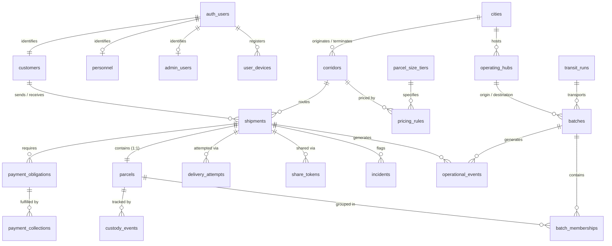

# CERELO V1 DATABASE & BACKEND DOMAIN ARCHITECTURE

> **Document Status:** Authoritative Backend Domain Model & Relational Data Architecture for Cerelo V1  
> **Pre-requisite References:** `CERELO_PRODUCT_CONTEXT.md`, `CERELO_V1_REQUIREMENTS_FREEZE.md`, `CERELO_USER_JOURNEYS_AND_STATE_MACHINE.md`, and `CERELO_TECHNICAL_ARCHITECTURE.md`  
> **Target Database Platform:** Managed Supabase (PostgreSQL 15+)  

---

## A. Executive Domain Architecture

Cerelo V1’s backend domain architecture is designed as a **relational, transactional, and audit-immutable domain model** that maps 1-to-1 with physical intercity logistics reality.

### Core Architectural Principles
1. **Relational Integrity Over Overloaded Fields:** Entity boundaries are clean and strictly decoupled (e.g., `Shipments`, `Parcels`, `Batches`, `PaymentObligations`, and `OperationalEvents` are distinct entities, not a single monolithic table).
2. **Snapshotting vs. Live Referencing:** Historical shipment contracts preserve immutable snapshots of customer names, addresses, price quotes, and sizes at transaction time.
3. **Dual State & History Architecture:** Current operational state is denormalized directly on primary entities for sub-millisecond query performance, while every state mutation is backed by an append-only, immutable `operational_events` ledger.
4. **Server-Authoritative Domain Engine:** Clients never issue raw `UPDATE` queries on sensitive lifecycle columns. All state transitions, payments, and custody handoffs execute inside atomic PostgreSQL RPC functions (`PL/pgSQL`) and Deno Edge Functions.
5. **Anti-Enumeration by Design:** Internal database Primary Keys use UUIDv7 (time-ordered UUIDs), while public-facing Delivery Codes are cryptographically generated, non-sequential alphanumeric identifiers.

---

## B. Domain Boundaries

The backend domain is partitioned into 13 cohesive logical modules within a modular monolith architecture:

```
┌────────────────────────────────────────────────────────────────────────────────────────┐
│                              CERELO V1 DOMAIN MODULE BOUNDARIES                        │
├─────────────────────┬─────────────────────────────────┬────────────────────────────────┤
│ Module Name         │ Core Domain Responsibility      │ Key Entities Managed           │
├─────────────────────┼─────────────────────────────────┼────────────────────────────────┤
│ 1. Identity & Access│ User identity, auth mapping,    │ `customers`, `personnel`,      │
│                     │ roles, and device push tokens.  │ `admin_users`, `user_devices`  │
├─────────────────────┼─────────────────────────────────┼────────────────────────────────┤
│ 2. Geography & Hubs │ Supported cities, operating     │ `cities`, `corridors`,         │
│                     │ hubs, and corridor directions.  │ `operating_hubs`               │
├─────────────────────┼─────────────────────────────────┼────────────────────────────────┤
│ 3. Pricing Config   │ Route/size base pricing tiers.  │ `parcel_size_tiers`,           │
│                     │                                 │ `pricing_rules`                │
├─────────────────────┼─────────────────────────────────┼────────────────────────────────┤
│ 4. Shipments        │ Customer door-to-door contract. │ `shipments`, `share_tokens`    │
├─────────────────────┼─────────────────────────────────┼────────────────────────────────┤
│ 5. Parcels          │ Physical item custody & size.   │ `parcels`, `parcel_qrs`        │
├─────────────────────┼─────────────────────────────────┼────────────────────────────────┤
│ 6. Payments         │ Obligations, cash collections.  │ `payment_obligations`,         │
│                     │                                 │ `payment_collections`          │
├─────────────────────┼─────────────────────────────────┼────────────────────────────────┤
│ 7. Batches          │ Consolidation containers.       │ `batches`, `batch_memberships` │
├─────────────────────┼─────────────────────────────────┼────────────────────────────────┤
│ 8. Transit          │ Middle-mile movement runs.      │ `transit_runs`                 │
├─────────────────────┼─────────────────────────────────┼────────────────────────────────┤
│ 9. Custody          │ Physical responsibility ledger. │ `custody_events`               │
├─────────────────────┼─────────────────────────────────┼────────────────────────────────┤
│ 10. Operations      │ Field task assignments & SOPs.  │ `field_tasks`, `call_logs`     │
├─────────────────────┼─────────────────────────────────┼────────────────────────────────┤
│ 11. Event Ledger    │ Immutable operational trail.    │ `operational_events`           │
├─────────────────────┼─────────────────────────────────┼────────────────────────────────┤
│ 12. Incidents       │ Exceptions & reconciliation.    │ `incidents`, `delivery_attempts`│
├─────────────────────┼─────────────────────────────────┼────────────────────────────────┤
│ 13. Notifications   │ Outbox queue & delivery status. │ `notification_outbox`          │
└─────────────────────┴─────────────────────────────────┴────────────────────────────────┘
```

---

## C. Identity & Account Model

### 1. Auth User vs. Customer Profile
* **`auth.users` (Supabase Managed):** Stores core authentication credentials (email, Google OAuth provider ID, password hash, encrypted JWT metadata).
* **`customers` (Application Domain):** 1-to-1 relationship with `auth.users`. Contains domain profile information: `full_name`, `phone_number` (canonical E.164), `account_type` (`INDIVIDUAL` vs. `BUSINESS`), and optional `business_name`.

### 2. Single Account for Senders & Receivers
A user does not register a "Sender Account" or "Receiver Account". In the database, a Customer is simply an entity in `customers`.
* When a user creates a shipment, their ID is recorded as `shipments.sender_customer_id`.
* When a user receives a shipment, their ID is linked as `shipments.receiver_customer_id`.

### 3. Receiver Relationship & Progressive Linking
When a Sender creates a request, the Receiver might not yet have a Cerelo account. The shipment captures:
* `receiver_name_snapshot`: String entered by Sender.
* `receiver_phone_snapshot`: Canonical phone number entered by Sender.
* `receiver_delivery_address_snapshot`: Destination address text.
* `receiver_customer_id`: `NULL` initially.

**Progressive Linking Rule:** When a user with a matching verified phone number logs into Cerelo or claims a shared tracking link, the server sets `shipments.receiver_customer_id = customer.id` without altering historical snapshot strings.

### 4. Personnel & Admin Roles
* **`personnel`:** Contains field staff profile linked to `auth.users`, including `assigned_hub_id`, `is_active`, `phone_number`, and employee reference.
* **`admin_users`:** Contains internal operations/admin staff profile linked to `auth.users`, including `admin_role` (`SUPER_ADMIN`, `OPS_MANAGER`, `SUPPORT`) and `is_active`.

---

## D. Location & Corridor Model

### 1. Cities & Hubs
* **`cities`:** Master list of supported cities (`Kano`, `Katsina`).
* **`operating_hubs`:** Physical sorting/consolidation points (`Kano Central Hub - Kwari`, `Katsina Central Hub`). Foreign key to `cities.id`.

### 2. Directional Corridors
Corridors are modeled **directionally** to allow independent pricing, route utilization metrics, and schedule management:
* Corridor 1: `Kano Hub` → `Katsina Hub` (`code: KAN-KAT`, `is_active: true`)
* Corridor 2: `Katsina Hub` → `Kano Hub` (`code: KAT-KAN`, `is_active: true`)

---

## E. Shipment Model

The `shipments` entity represents the top-level commercial agreement between the Customer and Cerelo.

### Key Fields & Attributes
* `id` (UUIDv7, PK): Internal system identifier.
* `delivery_code` (VARCHAR, Unique): Non-sequential human reference (e.g. `CRL-8F2K-9P3N`).
* `sender_customer_id` (UUID, FK → `customers.id`): Creator/sender of shipment.
* `receiver_customer_id` (UUID, Nullable, FK → `customers.id`): Linked receiver account.
* `corridor_id` (UUID, FK → `corridors.id`): Active directional corridor.
* `origin_hub_id` (UUID, FK → `operating_hubs.id`): Origin sorting hub.
* `destination_hub_id` (UUID, FK → `operating_hubs.id`): Destination sorting hub.
* **Snapshots:** `sender_name_snapshot`, `sender_phone_snapshot`, `sender_pickup_address_snapshot`, `receiver_name_snapshot`, `receiver_phone_snapshot`, `receiver_delivery_address_snapshot`.
* **Financials:** `quoted_price_amount` (INTEGER, Minor units/Kobo or Naira), `final_price_amount` (INTEGER), `currency` (`NGN`), `payment_mode` (`SENDER_PAYS`, `RECEIVER_PAYS`, `SPLIT_PAYMENT`).
* **State:** `current_status` (Enum: `REQUESTED`, `PICKUP_IN_PROGRESS`, `PARCEL_CONFIRMED`, `AT_ORIGIN_HUB`, `BATCHED`, `IN_TRANSIT`, `ARRIVED_DESTINATION`, `OUT_FOR_DELIVERY`, `DELIVERED`, `DELIVERY_FAILED`, `CANCELLED`).
* `created_at`, `updated_at`.

---

## F. Parcel Model

In V1, each Shipment has exactly **one physical Parcel** (`1-to-1` cardinality).

### Key Fields & Attributes
* `id` (UUIDv7, PK): Internal physical parcel identifier.
* `shipment_id` (UUID, Unique, FK → `shipments.id`): Direct parent shipment.
* `sender_declared_size_id` (UUID, FK → `parcel_size_tiers.id`): Sender estimate.
* `confirmed_size_id` (UUID, Nullable, FK → `parcel_size_tiers.id`): Personnel-verified size.
* `category_description` (TEXT): Description of contents.
* `parcel_qr_token` (VARCHAR, Unique): Opaque cryptographically signed token string.
* `current_parcel_state` (Enum: `UNCONFIRMED`, `IN_CERELO_CUSTODY`, `ORIGIN_HUB_STAGED`, `BATCH_LOCKED`, `CORRIDOR_TRANSIT`, `DESTINATION_HUB_STAGED`, `FINAL_DELIVERY_STAGED`, `HANDED_OVER`).
* `current_custody_type` (Enum: `SENDER`, `PERSONNEL`, `HUB`, `TRANSIT_PARTNER`, `RECEIVER`).
* `current_custody_holder_id` (UUID, Nullable): References `personnel.id`, `operating_hubs.id`, etc.
* `confirmed_at`, `confirmed_by_personnel_id`.

---

## G. Delivery Code & QR Model

```
┌────────────────────────────────────────────────────────────────────────────────────────┐
│                              IDENTIFIER RESOLUTION ARCHITECTURE                        │
├─────────────────────┬───────────────────────┬──────────────────────────────────────────┤
│ Identifier Type     │ Entity Stored On      │ Security & Lookup Pattern                │
├─────────────────────┼───────────────────────┼──────────────────────────────────────────┤
│ 1. Delivery Code    │ `shipments.delivery_  │ Non-sequential alphanumeric (8 chars).   │
│                     │  code`                │ Rate-limited lookup API (anti-bruteforce)│
├─────────────────────┼───────────────────────┼──────────────────────────────────────────┤
│ 2. Parcel QR Token  │ `parcels.parcel_qr_   │ Cryptographic signed JWS opaque string.  │
│                     │  token`               │ Authenticated Personnel scanning endpoint│
├─────────────────────┼───────────────────────┼──────────────────────────────────────────┤
│ 3. Batch QR Token   │ `batches.batch_qr_    │ Cryptographic signed JWS opaque string.  │
│                     │  token`               │ Authenticated Personnel scanning endpoint│
└─────────────────────┴───────────────────────┴──────────────────────────────────────────┘
```

* **Label Assets:** Generated on demand or stored in Supabase Storage (`qr-labels/{parcel_id}.pdf`). Storage URLs are referenced in `parcels.qr_label_url`.

---

## H. Pricing Model

### 1. Configurable Pricing Rules
* **`parcel_size_tiers`:** `code` (`SMALL`, `MEDIUM`, `LARGE`), `name`, `max_weight_kg`, `max_dimensions_cm`, `is_active`.
* **`pricing_rules`:** `corridor_id`, `parcel_size_tier_id`, `base_price_amount` (INTEGER in Naira), `effective_from`, `effective_to`, `is_active`.

### 2. Price Adjustment Workflow
If Personnel corrects a size from `SMALL` (₦3,000) to `MEDIUM` (₦4,500) during pickup:
1. `shipments.final_price_amount` is updated to ₦4,500.
2. `payment_obligations` are recalculated and updated.
3. An audit record is inserted into `price_adjustments` storing `original_price`, `adjusted_price`, `reason`, `adjusted_by_personnel_id`, and `created_at`.

---

## I. Payment Domain

```
                             ┌──────────────────────────────┐
                             │       SHIPMENT ORDER         │
                             │  Total Fee: ₦3,000 (Split)   │
                             └──────────────┬───────────────┘
                                            │
                    ┌───────────────────────┴───────────────────────┐
                    ▼                                               ▼
     ┌─────────────────────────────┐                 ┌─────────────────────────────┐
     │ SENDER PAYMENT OBLIGATION   │                 │ RECEIVER PAYMENT OBLIGATION │
     │ Expected: ₦1,500            │                 │ Expected: ₦1,500            │
     │ Status: COLLECTED           │                 │ Status: PENDING             │
     └──────────────┬──────────────┘                 └──────────────┬──────────────┘
                    │                                               │
                    ▼ (At Pickup)                                   ▼ (At Doorstep)
     ┌─────────────────────────────┐                 ┌─────────────────────────────┐
     │ PAYMENT COLLECTION #1       │                 │ PAYMENT COLLECTION #2       │
     │ Amount: ₦1,500 (Cash)       │                 │ Amount: ₦1,500 (Transfer)   │
     │ Collector: Personnel A      │                 │ Collector: Personnel B      │
     └─────────────────────────────┘                 └─────────────────────────────┘
```

### 1. `payment_obligations` Entity
* `id` (UUIDv7, PK)
* `shipment_id` (UUID, FK → `shipments.id`)
* `payer_party` (`SENDER` or `RECEIVER`)
* `expected_amount` (INTEGER)
* `status` (`NOT_REQUIRED`, `PENDING`, `COLLECTED`, `FAILED`, `REFUSED`)

### 2. `payment_collections` Entity (Append-Only)
* `id` (UUIDv7, PK)
* `payment_obligation_id` (UUID, FK → `payment_obligations.id`)
* `shipment_id` (UUID, FK → `shipments.id`)
* `amount_collected` (INTEGER)
* `payment_method` (`CASH`, `BANK_TRANSFER`)
* `collected_by_personnel_id` (UUID, FK → `personnel.id`)
* `collected_at` (TIMESTAMPTZ)
* `idempotency_key` (VARCHAR, Unique)

---

## J. Batch Domain

### 1. `batches` Entity
Represents the physical consolidation container moving between hubs:
* `id` (UUIDv7, PK)
* `batch_number` (VARCHAR, e.g. `BAT-20260817-001`)
* `corridor_id` (UUID, FK → `corridors.id`)
* `origin_hub_id` (UUID, FK → `operating_hubs.id`)
* `destination_hub_id` (UUID, FK → `operating_hubs.id`)
* `batch_qr_token` (VARCHAR, Unique)
* `status` (`DRAFT`, `CONFIRMED`, `ONBOARDED`, `DESTINATION_RECEIVED`, `RECONCILING`, `RECONCILED`, `CLOSED`)
* `created_by_personnel_id`, `confirmed_by_personnel_id`, `onboarded_by_personnel_id`.
* `confirmed_at`, `onboarded_at`, `destination_received_at`, `reconciled_at`, `closed_at`.

### 2. `batch_memberships` Entity
Represents the explicit relation between a Parcel and a Batch:
* `id` (UUIDv7, PK)
* `batch_id` (UUID, FK → `batches.id`)
* `parcel_id` (UUID, FK → `parcels.id`)
* `added_by_personnel_id` (UUID, FK → `personnel.id`)
* `added_at` (TIMESTAMPTZ)
* `reconciliation_status` (`PENDING`, `MATCHED`, `MISSING`, `UNMANIFESTED`, `DAMAGED`)
* `reconciled_at`, `reconciled_by_personnel_id`.
* **Constraint:** A unique partial index ensures `parcel_id` can only belong to ONE active batch (`status != 'CLOSED'`).

---

## K. Middle-Mile Domain

### 1. `transit_runs` Entity
Decouples transport arrangements from Batches to track unit economics:
* `id` (UUIDv7, PK)
* `corridor_id` (UUID, FK → `corridors.id`)
* `provider_name` (VARCHAR, e.g. `Kwankwasiyya Commercial Services`)
* `driver_name` (VARCHAR), `driver_phone` (VARCHAR), `vehicle_plate_number` (VARCHAR)
* `capacity_cost_amount` (INTEGER in Naira, e.g. ₦7,000)
* `departed_at` (TIMESTAMPTZ), `arrived_at` (TIMESTAMPTZ)
* `status` (`SCHEDULED`, `IN_TRANSIT`, `COMPLETED`, `CANCELLED`)

*Relation:* `batches.transit_run_id` (Nullable FK → `transit_runs.id`).

---

## L. Destination Reconciliation Model

Reconciliation is tracked at the item level in `batch_memberships`:
1. Destination Personnel scans `batches.batch_qr_token`, loading expected items where `batch_memberships.batch_id = batch.id`.
2. As each physical Parcel QR is scanned, the server updates `batch_memberships.reconciliation_status = 'MATCHED'`.
3. If an unscanned item remains upon closing reconciliation, server sets `reconciliation_status = 'MISSING'` and creates an entry in `incidents`.
4. If an unmanifested item is scanned, server creates a `batch_memberships` record with `reconciliation_status = 'UNMANIFESTED'` and flags an incident.

---

## M. Final Delivery Model

### 1. `delivery_attempts` Entity
Tracks doorstep attempts without overloading terminal states:
* `id` (UUIDv7, PK)
* `shipment_id` (UUID, FK → `shipments.id`)
* `attempt_number` (INTEGER, e.g. 1, 2)
* `personnel_id` (UUID, FK → `personnel.id`)
* `outcome` (`SUCCESSFUL`, `RECEIVER_ABSENT`, `PAYMENT_REFUSED`, `ADDRESS_INACCESSIBLE`)
* `attempted_at` (TIMESTAMPTZ), `notes` (TEXT)

### 2. Dual Delivery Completion
* **Personnel Operational Completion:** `shipments.current_status = 'DELIVERED'`, `shipments.delivered_at = NOW()`, `shipments.delivered_by_personnel_id = personnel.id`.
* **Receiver App Acknowledgement:** `shipments.receiver_confirmed_at = NOW()`, `shipments.receiver_confirmed_by_customer_id = customer.id`.

---

## N. Custody Model

### `custody_events` Entity (Append-Only Ledger)
Every physical handoff is recorded in an immutable ledger:
* `id` (UUIDv7, PK)
* `parcel_id` (UUID, FK → `parcels.id`)
* `previous_custody_type`, `previous_custody_holder_id`
* `new_custody_type`, `new_custody_holder_id`
* `transfer_event_type` (`PICKUP_CONFIRMED`, `HUB_INBOUND`, `BATCH_LOADED`, `DESTINATION_RECONCILED`, `DOORSTEP_HANDOVER`)
* `transferred_at` (TIMESTAMPTZ)
* `witness_actor_id` (UUID)

---

## O. Operational Events Model

### `operational_events` Entity (Typed Event Ledger)
* `id` (UUIDv7, PK)
* `aggregate_type` (`SHIPMENT`, `PARCEL`, `BATCH`, `PAYMENT`)
* `aggregate_id` (UUID)
* `event_type` (VARCHAR, e.g. `PARCEL_CONFIRMED`, `BATCH_ONBOARDED`)
* `actor_id` (UUID), `actor_role` (`CUSTOMER`, `PERSONNEL`, `ADMIN`, `SYSTEM`)
* `location_hub_id` (UUID, Nullable)
* `payload` (JSONB)
* `created_at` (TIMESTAMPTZ)

*Rule:* RLS policies block `UPDATE` and `DELETE` on this table.

---

## P. Exceptions & Incidents

### `incidents` Entity
Structured operational incident tracking:
* `id` (UUIDv7, PK)
* `incident_number` (VARCHAR, e.g. `INC-20260817-004`)
* `category` (`RECEIVER_UNREACHABLE`, `SIZE_DISPUTE`, `PAYMENT_REFUSED`, `PARCEL_MISSING_IN_TRANSIT`, `PARCEL_DAMAGED`, `TRANSIT_DELAY`)
* `severity` (`LOW`, `MEDIUM`, `HIGH`, `BLOCKER`)
* `shipment_id` (Nullable), `parcel_id` (Nullable), `batch_id` (Nullable)
* `reported_by_actor_id`, `reported_at`
* `status` (`OPEN`, `INVESTIGATING`, `RESOLVED`, `ESCALATED`)
* `resolution_notes`, `resolved_by_admin_id`, `resolved_at`

---

## Q. Notifications Domain

### 1. `user_devices` Entity
Stores FCM push tokens separately from profiles:
* `id` (UUIDv7, PK)
* `user_id` (UUID, FK → `auth.users.id`)
* `fcm_token` (TEXT, Unique)
* `device_os` (`ANDROID`, `IOS`, `WEB`)
* `is_active` (BOOLEAN), `updated_at` (TIMESTAMPTZ)

### 2. `notification_outbox` Entity (Transactional Outbox)
* `id` (UUIDv7, PK)
* `recipient_user_id` (UUID), `recipient_phone` (VARCHAR)
* `channel` (`PUSH`, `SMS`)
* `event_type` (VARCHAR), `title` (VARCHAR), `body` (TEXT), `data_payload` (JSONB)
* `status` (`PENDING`, `SENT`, `FAILED`)
* `retry_count` (INTEGER), `created_at` (TIMESTAMPTZ), `sent_at` (TIMESTAMPTZ)

---

## R. Sharing & Receiver Linking

### `share_tokens` Entity
* `id` (UUIDv7, PK)
* `shipment_id` (UUID, FK → `shipments.id`)
* `token` (VARCHAR, Unique cryptographically random string)
* `created_by_customer_id` (UUID)
* `expires_at` (TIMESTAMPTZ, default 30 days)
* `is_revoked` (BOOLEAN)

---

## S. Audit Architecture

### `audit_logs` Entity (Security & Governance)
* `id` (UUIDv7, PK)
* `actor_id` (UUID), `actor_role` (VARCHAR)
* `action` (`ADMIN_SIZE_OVERRIDE`, `PRICE_CONFIG_UPDATE`, `USER_ROLE_MODIFIED`, `PAYMENT_ADJUSTMENT`)
* `target_entity_type` (VARCHAR), `target_entity_id` (UUID)
* `old_values` (JSONB), `new_values` (JSONB)
* `ip_address` (INET), `user_agent` (TEXT)
* `created_at` (TIMESTAMPTZ)

---

## T. Configuration vs. Transaction Data Matrix

```
┌──────────────────────────────────────┬──────────────────────────────────────────┐
│ Configuration Data (Schema / Tables) │ Transactional Data (Append/State Tables) │
├──────────────────────────────────────┼──────────────────────────────────────────┤
│ • `cities`                           │ • `shipments`                            │
│ • `corridors`                        │ • `parcels`                              │
│ • `operating_hubs`                   │ • `batches` & `batch_memberships`        │
│ • `parcel_size_tiers`                │ • `payment_obligations` & `collections`  │
│ • `pricing_rules`                    │ • `custody_events`                       │
│ • Static Enum Types                  │ • `operational_events`                   │
└──────────────────────────────────────┴──────────────────────────────────────────┘
```

---

## U. Entity Relationship Diagram (ERD)



---

## V. Entity Specifications

### 1. `shipments`
* **Purpose:** Primary customer delivery contract.
* **Fields:** `id` (UUIDv7, PK), `delivery_code` (VARCHAR(16), Unique), `sender_customer_id` (UUID, FK), `receiver_customer_id` (UUID, Nullable, FK), `corridor_id` (UUID, FK), `origin_hub_id` (UUID, FK), `destination_hub_id` (UUID, FK), `sender_name_snapshot` (VARCHAR), `sender_phone_snapshot` (VARCHAR), `sender_pickup_address_snapshot` (TEXT), `receiver_name_snapshot` (VARCHAR), `receiver_phone_snapshot` (VARCHAR), `receiver_delivery_address_snapshot` (TEXT), `quoted_price_amount` (INTEGER), `final_price_amount` (INTEGER), `currency` (VARCHAR(3)), `payment_mode` (VARCHAR(20)), `current_status` (VARCHAR(30)), `delivered_at` (TIMESTAMPTZ), `delivered_by_personnel_id` (UUID, FK), `receiver_confirmed_at` (TIMESTAMPTZ), `receiver_confirmed_by_customer_id` (UUID, FK), `created_at` (TIMESTAMPTZ), `updated_at` (TIMESTAMPTZ).
* **Constraints:** `CHECK (quoted_price_amount >= 0)`, `CHECK (final_price_amount >= 0)`.
* **Indexes:** `CREATE UNIQUE INDEX idx_shipments_delivery_code ON shipments(delivery_code)`, `CREATE INDEX idx_shipments_sender ON shipments(sender_customer_id)`, `CREATE INDEX idx_shipments_receiver ON shipments(receiver_customer_id)`, `CREATE INDEX idx_shipments_status ON shipments(current_status)`.
* **Mutability:** Snapshots and `delivery_code` are immutable after creation; `current_status` and final delivery fields updated via server RPCs only.

### 2. `parcels`
* **Purpose:** Physical item entity in custody.
* **Fields:** `id` (UUIDv7, PK), `shipment_id` (UUID, Unique, FK), `sender_declared_size_id` (UUID, FK), `confirmed_size_id` (UUID, Nullable, FK), `category_description` (TEXT), `parcel_qr_token` (VARCHAR(64), Unique), `qr_label_url` (TEXT), `current_parcel_state` (VARCHAR(30)), `current_custody_type` (VARCHAR(20)), `current_custody_holder_id` (UUID, Nullable), `confirmed_at` (TIMESTAMPTZ), `confirmed_by_personnel_id` (UUID, Nullable, FK), `created_at` (TIMESTAMPTZ), `updated_at` (TIMESTAMPTZ).
* **Constraints:** `UNIQUE(shipment_id)`, `UNIQUE(parcel_qr_token)`.
* **Indexes:** `CREATE INDEX idx_parcels_qr_token ON parcels(parcel_qr_token)`, `CREATE INDEX idx_parcels_custody ON parcels(current_custody_type, current_custody_holder_id)`.

### 3. `batches`
* **Purpose:** Consolidation container for middle-mile movement.
* **Fields:** `id` (UUIDv7, PK), `batch_number` (VARCHAR(32), Unique), `corridor_id` (UUID, FK), `origin_hub_id` (UUID, FK), `destination_hub_id` (UUID, FK), `transit_run_id` (UUID, Nullable, FK), `batch_qr_token` (VARCHAR(64), Unique), `status` (VARCHAR(30)), `created_by_personnel_id` (UUID, FK), `confirmed_by_personnel_id` (UUID, Nullable, FK), `onboarded_by_personnel_id` (UUID, Nullable, FK), `confirmed_at` (TIMESTAMPTZ), `onboarded_at` (TIMESTAMPTZ), `destination_received_at` (TIMESTAMPTZ), `reconciled_at` (TIMESTAMPTZ), `closed_at` (TIMESTAMPTZ), `created_at` (TIMESTAMPTZ).
* **Constraints:** `UNIQUE(batch_number)`, `UNIQUE(batch_qr_token)`.
* **Indexes:** `CREATE INDEX idx_batches_corridor_status ON batches(corridor_id, status)`.

### 4. `batch_memberships`
* **Purpose:** Relationship between Batches and Parcels.
* **Fields:** `id` (UUIDv7, PK), `batch_id` (UUID, FK), `parcel_id` (UUID, FK), `added_by_personnel_id` (UUID, FK), `added_at` (TIMESTAMPTZ), `reconciliation_status` (VARCHAR(20)), `reconciled_at` (TIMESTAMPTZ), `reconciled_by_personnel_id` (UUID, Nullable, FK).
* **Constraints:** Unique partial index ensuring a parcel cannot be in two unclosed batches simultaneously: `CREATE UNIQUE INDEX idx_unique_active_parcel_batch ON batch_memberships(parcel_id) WHERE reconciliation_status != 'CLOSED'`.

### 5. `payment_obligations`
* **Purpose:** Payer responsibility breakdown per shipment.
* **Fields:** `id` (UUIDv7, PK), `shipment_id` (UUID, FK), `payer_party` (VARCHAR(10)), `expected_amount` (INTEGER), `status` (VARCHAR(20)), `created_at` (TIMESTAMPTZ), `updated_at` (TIMESTAMPTZ).
* **Constraints:** `CHECK (expected_amount >= 0)`, `CHECK (payer_party IN ('SENDER', 'RECEIVER'))`.

### 6. `payment_collections`
* **Purpose:** Immutable cash/transfer payment transaction ledger.
* **Fields:** `id` (UUIDv7, PK), `payment_obligation_id` (UUID, FK), `shipment_id` (UUID, FK), `amount_collected` (INTEGER), `payment_method` (VARCHAR(20)), `collected_by_personnel_id` (UUID, FK), `collected_at` (TIMESTAMPTZ), `idempotency_key` (VARCHAR(64), Unique), `created_at` (TIMESTAMPTZ).
* **Constraints:** `CHECK (amount_collected > 0)`, `UNIQUE(idempotency_key)`.

---

## W. Cardinality & Relationship Rules

1. `customers` (1) ──── (N) `shipments` (as Sender)
2. `customers` (1) ──── (N) `shipments` (as Receiver)
3. `shipments` (1) ──── (1) `parcels` (Strict 1-to-1 in V1)
4. `shipments` (1) ──── (N) `payment_obligations` (Max 2: 1 Sender + 1 Receiver)
5. `payment_obligations` (1) ──── (N) `payment_collections` (Typically 1-to-1)
6. `batches` (1) ──── (N) `batch_memberships` ──── (1) `parcels`
7. `transit_runs` (1) ──── (N) `batches`
8. `parcels` (1) ──── (N) `custody_events` (1-to-N append-only history)
9. `shipments` (1) ──── (N) `delivery_attempts`

---

## X. Domain Invariants

1. **Shipment Payer Invariant:** `SUM(payment_obligations.expected_amount) == shipments.final_price_amount`.
2. **Single Active Batch Invariant:** A parcel CANNOT belong to more than one active (`status != 'CLOSED'`) batch at any point in time.
3. **Pickup Confirmation Gating:** `parcels.current_parcel_state` CANNOT become `IN_CERELO_CUSTODY` (`PARCEL_CONFIRMED`) unless `payment_obligations[SENDER]` status is `COLLECTED` (for `SENDER_PAYS` and `SPLIT_PAYMENT`).
4. **Delivery Completion Gating:** `shipments.current_status` CANNOT become `DELIVERED` unless `payment_obligations[RECEIVER]` status is `COLLECTED` (for `RECEIVER_PAYS` and `SPLIT_PAYMENT`).
5. **No Negative Currency:** All monetary columns (`expected_amount`, `amount_collected`, `quoted_price_amount`, `final_price_amount`, `capacity_cost_amount`) MUST be integers >= 0.

---

## Y. Database Constraints vs. Domain Constraints

```
┌──────────────────────────────────────┬──────────────────────────────────────────┐
│ Database-Enforced Constraints (SQL)  │ Domain-Enforced Constraints (RPC/Server) │
├──────────────────────────────────────┼──────────────────────────────────────────┤
│ • Foreign Key Referential Integrity  │ • Receiver Phone Verification Call Gate  │
│ • Non-negative monetary amounts      │ • Status Transition Precondition Checks  │
│ • Unique Delivery Code & QR tokens   │ • Split Payment Ratio Derivation Logic   │
│ • Unique Active Parcel Batch Index   │ • Offline Queue Sync Validation          │
│ • Append-only RLS on Event Tables    │ • Role Permission Execution Gating       │
└──────────────────────────────────────┴──────────────────────────────────────────┘
```

---

## Z. Indexing Strategy

```sql
-- 1. High-frequency Customer Queries
CREATE INDEX idx_shipments_sender_created ON shipments(sender_customer_id, created_at DESC);
CREATE INDEX idx_shipments_receiver_created ON shipments(receiver_customer_id, created_at DESC);
CREATE UNIQUE INDEX idx_shipments_delivery_code ON shipments(delivery_code);

-- 2. High-frequency Personnel Scanning Lookups
CREATE UNIQUE INDEX idx_parcels_qr_token ON parcels(parcel_qr_token);
CREATE UNIQUE INDEX idx_batches_qr_token ON batches(batch_qr_token);
CREATE INDEX idx_parcels_hub_staged ON parcels(current_custody_holder_id, current_parcel_state) 
  WHERE current_parcel_state = 'ORIGIN_HUB_STAGED';

-- 3. Batch Membership & Reconciliation Lookups
CREATE INDEX idx_batch_memberships_batch_id ON batch_memberships(batch_id);
CREATE UNIQUE INDEX idx_unique_active_parcel_batch ON batch_memberships(parcel_id) 
  WHERE reconciliation_status != 'CLOSED';

-- 4. Operational Event Timeline Lookups
CREATE INDEX idx_op_events_aggregate ON operational_events(aggregate_type, aggregate_id, created_at ASC);
```

---

## AA. State & Event Storage Strategy

* **Current State Denormalization:** Current operational state is stored directly in `shipments.current_status`, `parcels.current_parcel_state`, and `batches.status` for sub-millisecond filtering and UI rendering.
* **Transactional Synchronization:** Every RPC function that mutates a current state column MUST simultaneously `INSERT` the corresponding record into `operational_events` within the same database transaction block (`BEGIN...COMMIT`). If either fails, the transaction rolls back completely.

---

## AB. Backend Command Catalogue

| Command Name | Executing Actor | Target Entities Mutated | Mandatory Preconditions | Emitted Events |
| :--- | :--- | :--- | :--- | :--- |
| `CreateShipmentRequest` | Customer (Sender) | `shipments`, `parcels`, `payment_obligations` | Supported corridor, valid addresses. | `SHIPMENT_REQUESTED` |
| `CancelShipmentRequest` | Customer (Sender) | `shipments` | `status == 'REQUESTED'` | `REQUEST_CANCELLED` |
| `ConfirmParcel` | Personnel | `shipments`, `parcels`, `payment_collections`, `custody_events` | Physical size verified, receiver called, pickup payment collected. | `PARCEL_CONFIRMED`, `SENDER_PAYMENT_COLLECTED` |
| `CreateBatch` | Personnel | `batches` | Valid corridor & origin hub. | `BATCH_CREATED` |
| `AddParcelToBatch` | Personnel | `batch_memberships`, `parcels` | Batch `DRAFT`, parcel `ORIGIN_HUB_STAGED`. | `PARCEL_ADDED_TO_BATCH` |
| `ConfirmBatch` | Personnel | `batches` | Batch `DRAFT`, count >= 1. | `BATCH_CONFIRMED` |
| `OnboardBatch` | Personnel | `batches`, `shipments`, `parcels`, `custody_events` | Batch `CONFIRMED`, vehicle departed. | `BATCH_ONBOARDED` |
| `ReceiveDestinationBatch` | Personnel | `batches` | Batch `ONBOARDED`, scanned at destination hub. | `BATCH_DESTINATION_RECEIVED` |
| `ReconcileParcel` | Personnel | `batch_memberships` | Batch `DESTINATION_RECEIVED`. | `PARCEL_RECONCILED` |
| `CompleteBatchReconciliation` | Personnel | `batches`, `shipments`, `parcels`, `custody_events` | 100% manifest accounted for (or flagged). | `RECONCILIATION_COMPLETED` |
| `StartFinalDelivery` | Personnel | `shipments`, `parcels`, `custody_events` | Parcel `ARRIVED_DESTINATION`. | `FINAL_DELIVERY_STARTED` |
| `MarkDelivered` | Personnel | `shipments`, `parcels`, `payment_collections`, `custody_events` | Receiver payment collected (if required), doorstep handover complete. | `PERSONNEL_DELIVERY_CONFIRMED`, `RECEIVER_PAYMENT_COLLECTED` |
| `ConfirmReceiverReceipt` | Customer (Receiver) | `shipments` | `status == 'DELIVERED'` | `RECEIVER_DELIVERY_CONFIRMED` |

---

## AC. Backend Query Catalogue

```
┌────────────────────────────────────────────────────────────────────────────────────────┐
│                              CORE BACKEND READ PROJECTIONS                            │
├─────────────────┬──────────────────────────────────────────────────────────────────────┤
│ Audience        │ Query Model & Purpose                                                │
├─────────────────┼──────────────────────────────────────────────────────────────────────┤
│ Customer        │ • `GetCustomerShipmentsSent`: List shipments where sender == auth.uid()│
│                 │ • `GetCustomerShipmentsReceived`: List where receiver == auth.uid()  │
│                 │ • `GetShipmentDetail`: Detail with sanitized public timeline events  │
│                 │ • `GetSharedShipmentView`: Sanitized tracking view via share token   │
├─────────────────┼──────────────────────────────────────────────────────────────────────┤
│ Personnel       │ • `GetActivePickupTasks`: Open requests in assigned hub city         │
│                 │ • `LookupParcelByQR`: Resolve parcel, size, payments, & action state │
│                 │ • `GetParcelsReadyForBatch`: Unbatched parcels staged at origin hub  │
│                 │ • `GetBatchManifest`: List items in batch with scan match status     │
│                 │ • `GetActiveDeliveryRoute`: Parcels out for delivery with receiver info│
├─────────────────┼──────────────────────────────────────────────────────────────────────┤
│ Admin           │ • `GetCorridorLiveOverview`: Active volume counts by corridor state  │
│                 │ • `GetIncidentQueue`: Open exceptions requiring resolution           │
│                 │ • `GetAuditTrail`: Immutable event history for specific shipment/user │
└─────────────────┴──────────────────────────────────────────────────────────────────────┘
```

---

## AD. Transaction Boundaries

```
┌─────────────────────────┬──────────────────────────────────────────────────────────────┐
│ Operation               │ Atomic Database Transaction Scope (`BEGIN...COMMIT`)         │
├─────────────────────────┼──────────────────────────────────────────────────────────────┤
│ 1. Confirm Parcel       │ (1) Update parcel size & fee ──► (2) Insert payment collection│
│                         │ (3) Update shipment status ──► (4) Insert custody event      │
│                         │ (5) Insert operational event ──► (6) Queue push notification │
├─────────────────────────┼──────────────────────────────────────────────────────────────┤
│ 2. Onboard Batch        │ (1) Update batch status to ONBOARDED                         │
│                         │ (2) Update all contained shipments to IN_TRANSIT             │
│                         │ (3) Update all contained parcels to CORRIDOR_TRANSIT         │
│                         │ (4) Insert batch & shipment operational events               │
│                         │ (5) Queue customer notification outbox messages              │
├─────────────────────────┼──────────────────────────────────────────────────────────────┤
│ 3. Mark Delivered       │ (1) Insert receiver payment collection (if required)         │
│                         │ (2) Update shipment status to DELIVERED                      │
│                         │ (3) Update parcel state to HANDED_OVER                       │
│                         │ (4) Insert custody handover event ──► (5) Insert op event    │
│                         │ (6) Queue sender SMS/push notification                       │
└─────────────────────────┴──────────────────────────────────────────────────────────────┘
```

---

## AE. Idempotency Strategy

* **API Level:** Critical mutation endpoints accept an `Idempotency-Key` header (UUID generated by client).
* **Database Level:** Payment collections enforce `UNIQUE(idempotency_key)`. Re-submitting an identical request returns the existing collection record without creating duplicate debits.
* **State Level:** State-changing RPCs check current status; executing `MarkDelivered` on an already `DELIVERED` shipment safely returns `200 OK` with the existing state.

---

## AF. Concurrency Strategy

* **Pessimistic Locking for State Transitions:** State-changing PL/pgSQL functions execute `SELECT * FROM shipments WHERE id = p_shipment_id FOR UPDATE` to serialize concurrent requests on the same shipment.
* **Atomic Batch Additions:** Adding a parcel to a batch executes `SELECT * FROM parcels WHERE id = p_parcel_id FOR UPDATE` and checks `current_parcel_state == 'ORIGIN_HUB_STAGED'` to prevent concurrent assignment to two batches.

---

## AG. Authorization Data Relationships (RLS Rules)

```
┌─────────────────────┬──────────────────────────────────────────────────────────────────┐
│ Target Entity       │ Row Level Security Policy Rule                                   │
├─────────────────────┼──────────────────────────────────────────────────────────────────┤
│ `shipments`         │ • Customer: `sender_customer_id = auth.uid()` OR                 │
│                     │   `receiver_customer_id = auth.uid()`                            │
│                     │ • Personnel: Assigned to origin or destination hub.              │
│                     │ • Admin: `auth.jwt().role == 'admin'`                            │
├─────────────────────┼──────────────────────────────────────────────────────────────────┤
│ `parcels`           │ • Customer: Via parent `shipments` ownership.                    │
│                     │ • Personnel: `auth.jwt().role == 'personnel'`                    │
├─────────────────────┼──────────────────────────────────────────────────────────────────┤
│ `operational_events`│ • Customer: SELECT sanitized events where aggregate_id in owned │
│                     │   shipments. INSERT/UPDATE/DELETE BLOCKED.                       │
│                     │ • Personnel/Admin: SELECT all. INSERT via RPC only.              │
└─────────────────────┴──────────────────────────────────────────────────────────────────┘
```

---

## AH. Source of Truth Matrix

| Information Domain | Authoritative Source of Truth |
| :--- | :--- |
| **User Authentication** | Supabase `auth.users` |
| **Customer Profile** | `customers` table |
| **Shipment Order Contract** | `shipments` table (Snapshots) |
| **Current Operational Status** | `shipments.current_status` |
| **Physical Item & Custody** | `parcels` table & `custody_events` |
| **Declared vs Verified Size** | `parcels.sender_declared_size_id` vs `parcels.confirmed_size_id` |
| **Consolidation Manifest** | `batch_memberships` table |
| **Cash Collected** | `payment_collections` table |
| **Chronological Audit Trail** | `operational_events` table |

---

## AI. Data Classification & Privacy

```
┌─────────────────────┬───────────────────────┬──────────────────────────────────────────┐
│ Sensitivity Class   │ Fields Covered        │ Protection & Exposure Policy             │
├─────────────────────┼───────────────────────┼──────────────────────────────────────────┤
│ 1. Direct PII       │ Full names, phones,   │ Masked in shared tracking links; scoped  │
│                     │ doorstep addresses    │ to assigned Personnel field tasks.       │
├─────────────────────┼───────────────────────┼──────────────────────────────────────────┤
│ 2. Public Tracking  │ Delivery Code, city   │ Unauthenticated tracking views expose    │
│    Data             │ names, status timeline│ ONLY status milestones & masked names.   │
├─────────────────────┼───────────────────────┼──────────────────────────────────────────┤
│ 3. Internal Ops     │ Batch IDs, Personnel  │ NEVER exposed to Customer or public      │
│    Data             │ names, vehicle plates │ tracking endpoints.                      │
└─────────────────────┴───────────────────────┴──────────────────────────────────────────┘
```

---

## AJ. Soft Delete & Data Retention Rules

* **Shipments, Parcels, Batches:** NEVER hard-deleted. Cancelled orders remain in `current_status = 'CANCELLED'`.
* **Financial & Audit Records:** `payment_collections`, `operational_events`, and `custody_events` are append-only and permanently retained.
* **Customer Account Deactivation:** Sets `customers.is_active = false`. Historical shipment snapshots remain intact for legal and operational accounting.

---

## AK. Metrics & Unit-Economic Readiness

The schema supports direct SQL aggregation queries for core V1 unit economics without requiring an external data warehouse:

```sql
-- Example: Kano -> Katsina Corridor Unit Economics Calculation
SELECT 
  b.id AS batch_id,
  b.batch_number,
  tr.capacity_cost_amount AS middle_mile_cost,
  COUNT(bm.parcel_id) AS total_parcels,
  SUM(s.final_price_amount) AS gross_batch_revenue,
  (SUM(s.final_price_amount) - tr.capacity_cost_amount) AS batch_contribution_margin
FROM batches b
JOIN transit_runs tr ON b.transit_run_id = tr.id
JOIN batch_memberships bm ON b.id = bm.batch_id
JOIN parcels p ON bm.parcel_id = p.id
JOIN shipments s ON p.shipment_id = s.id
WHERE b.status = 'CLOSED'
GROUP BY b.id, b.batch_number, tr.capacity_cost_amount;
```

---

## AL. Seed & Initial Configuration Requirements

The initial database seed migration shall populate strictly:
1. **Cities:** `Kano`, `Katsina`.
2. **Operating Hubs:** `Kano Central Hub`, `Katsina Central Hub`.
3. **Corridors:** `Kano Central Hub → Katsina Central Hub`, `Katsina Central Hub → Kano Central Hub`.
4. **Parcel Size Tiers:** `Small` (<= 3kg), `Medium` (<= 10kg), `Large` (<= 25kg).
5. **Pricing Rules:** Base prices per size tier for Kano ↔ Katsina corridor.

---

## AM. Future Extension Points

* **Corridor Expansion:** Insert new rows in `cities`, `operating_hubs`, and `corridors`.
* **Smart Box Hardware (V2):** Add `smart_box_containers` table with FK `batches.smart_box_id`.
* **Digital Gateways:** Add `PAYSTACK_REF` to `payment_collections.payment_method`.
* **Live GPS:** Attach `transit_run_telemetry` table linked to `transit_runs.id`.

---

## AN. Rejected Data-Model Alternatives

| Rejected Pattern | Reason for Rejection |
| :--- | :--- |
| **Single Monolithic `deliveries` Table** | Destroys relational integrity between commercial contracts, physical items, batches, and independent split payment collections. |
| **JSON Column for Batch Manifests** | Prevents database-level indexing and foreign-key constraints on parcel membership; makes reconciliation queries slow and error-prone. |
| **Single `is_paid` Boolean Flag** | Cannot support Split Payments where Sender pays at pickup and Receiver pays at destination. |
| **Separate Sender and Receiver Accounts** | Breaks the real-world merchant experience where a user sends 20 parcels and receives 5 supplies on the same account. |

---

## AO. Database Risks & Mitigations

1. **Concurrent Duplicate Batch Scans — [RANK: HIGH]**
   * *Mitigation:* Unique partial index `idx_unique_active_parcel_batch` on `batch_memberships`.
2. **Delivery Code Brute-Force Enumeration — [RANK: MEDIUM]**
   * *Mitigation:* Cryptographically random 8-character string (`pgcrypto`) + rate-limiting lookup endpoint.
3. **Unrecorded Physical Cash Collection — [RANK: HIGH]**
   * *Mitigation:* Software workflow gating—server blocks `ConfirmParcel` and `MarkDelivered` if cash collection RPC is omitted.

---

## AP. Decisions That Become Locked

1. PostgreSQL 15+ relational schema with strictly separated `shipments`, `parcels`, `batches`, `payment_obligations`, and `payment_collections`.
2. 1-to-1 cardinality between Shipment and Parcel in V1.
3. `operational_events` and `custody_events` are append-only and immutable.
4. Monetary amounts are stored as non-negative integers in Naira/Kobo.
5. Direct client SQL updates on lifecycle status columns are blocked via RLS; all mutations execute through server RPCs.

---

## AQ. Open Questions

*(No blocking open questions remain; all domain models align directly with frozen Prompt 1–4 requirements).*

---

## AR. Backend Domain Definition of Done

**DECLARATION:** The Database and Backend Domain Architecture for Cerelo V1 is **COMPLETE, RELATIONAL, AND LOCKED**.

The project is fully prepared to proceed to:
> **Prompt 6 — Cerelo Security, RBAC & Data Access Architecture**

---
*End of Cerelo V1 Database & Backend Domain Architecture Specification.*
