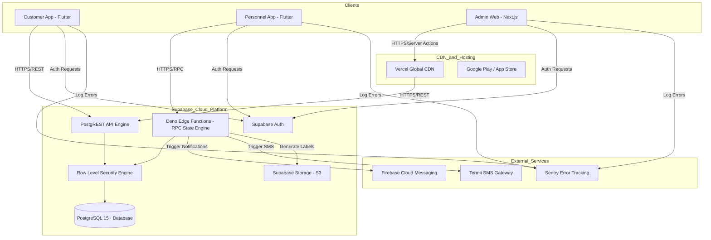

# CERELO V1 TECHNICAL ARCHITECTURE & STACK DECISION

> **Document Status:** Authoritative Technical Architecture & Infrastructure Specification  
> **Pre-requisite References:** `CERELO_PRODUCT_CONTEXT.md`, `CERELO_V1_REQUIREMENTS_FREEZE.md`, and `CERELO_USER_JOURNEYS_AND_STATE_MACHINE.md`  
> **Target Environment:** Kano ↔ Katsina Intercity Logistics Network  

---

## A. Executive Technical Recommendation

Cerelo V1 adopts a **Managed Hybrid Backend + Mobile Monorepo Architecture** designed for high developer velocity, ultra-low operating cost, strong security boundaries, and high reliability under intermittent Nigerian mobile connectivity.

```
┌────────────────────────────────────────────────────────────────────────────────────────┐
│                              CERELO V1 CLIENT & STACK ARCHITECTURE                     │
├───────────────────────┬─────────────────────────────────┬──────────────────────────────┤
│ 1. Mobile Apps        │ 2. Admin Web Application        │ 3. Backend Platform          │
├───────────────────────┼─────────────────────────────────┼──────────────────────────────┤
│ • Customer App        │ • Admin / Operations Panel      │ • Supabase (PostgreSQL 15+)  │
│   (Flutter / Dart)    │   (Next.js / React / TypeScript)│ • Supabase Auth & RLS        │
│ • Personnel App       │ • Responsive Web / PWA          │ • Serverless Edge Functions  │
│   (Flutter / Dart)    │ • Vercel Edge Hosting           │ • Supabase Storage           │
│ • Flutter Monorepo    │                                 │ • Firebase Cloud Messaging   │
└───────────────────────┴─────────────────────────────────┴──────────────────────────────┘
```

---

## B. Architecture Goals

1. **High Developer Velocity:** Leverage managed backend services (Supabase) and cross-platform mobile frameworks (Flutter) so a team of 1–3 developers can deliver V1 rapidly.
2. **Lean Operating Cost:** Run on free/low-cost cloud tiers ($0 to $25/month initial operating cost).
3. **Android-First Performance:** Optimized for entry-level to mid-range Android devices widely used in Northern Nigeria, with low memory footprints and fast camera QR scanning.
4. **Authoritative Server Control:** Prevent client tampering by enforcing state transitions, payment recordings, and custody handoffs strictly through server-side PostgreSQL Row Level Security (RLS) and transactional Edge Functions.
5. **Offline & Low-Bandwidth Resilience:** Robust mobile caching and network-resilient offline queues for non-critical operations, with clear visual feedback for server-confirmed actions.
6. **Auditability & Data Integrity:** Immutable event logging in PostgreSQL for all physical custody handoffs, QR scans, and financial transactions.

---

## C. System Constraints

* **Operational Scope:** Intercity Kano ↔ Katsina corridor ONLY. Intracity, live GPS maps, Smart Boxes, and digital wallets are strictly excluded from V1.
* **Connectivity Reality:** Cellular data in markets (Kwari Market), transport parks, and highway corridors can be spotty or intermittent.
* **Hardware Reality:** Personnel operate using affordable Android smartphones; camera QR scanning must be near-instantaneous under variable lighting.
* **Small Team Boundary:** Minimal DevOps overhead—no self-hosted Kubernetes clusters, complex Kafka event streams, or microservice infrastructure.

---

## D. Client Architecture

Cerelo V1 supports three distinct client surfaces across two primary codebases:

```
┌────────────────────────────────────────────────────────────────────────────────────────┐
│                                CLIENT SURFACE MATRIX                                   │
├──────────────────────┬──────────────────────────┬──────────────────────────────────────┤
│ Surface Name         │ Target User Group        │ Implementation Architecture          │
├──────────────────────┼──────────────────────────┼──────────────────────────────────────┤
│ 1. Customer Mobile   │ Senders & Receivers      │ Flutter Mobile App (Android & iOS)   │
│ 2. Personnel Mobile  │ Field Personnel          │ Dedicated Flutter Mobile App         │
│                      │                          │ (Monorepo package sharing)           │
│ 3. Admin Operations  │ Operations & Admins      │ Responsive Next.js Web App / PWA     │
└──────────────────────┴──────────────────────────┴──────────────────────────────────────┘
```

### Justification for Dedicated Personnel Mobile App vs. PWA
Field Personnel rely heavily on rapid camera QR scanning, thermal Bluetooth printing, background push notifications, and local offline queuing. A **native Flutter mobile app** compiled from the same monorepo as the Customer App provides superior camera performance, Bluetooth hardware access, and OS-level lifecycle management compared to a web PWA.

---

## E. Mobile Framework Decision

### Decision: Flutter (Dart)
Both the Customer Mobile App and Personnel Mobile App will be built using **Flutter (Dart)** inside a monorepo workspace.

### Why Flutter Fits Cerelo
* **Sub-second Camera QR Performance:** Highly optimized `mobile_scanner` library using native Android CameraX / iOS AVFoundation bindings.
* **Android-First Performance:** Compiles to ARM native machine code, running smoothly on entry-level Android devices in Kano/Katsina.
* **Code Reuse:** Shared Dart packages for API clients, data models, status enums, validation logic, and design tokens between Customer and Personnel apps.
* **Robust Ecosystem:** First-class support for Supabase Auth, Firebase Cloud Messaging, Bluetooth thermal printing, and SQLite caching.

### Alternatives Considered & Rejected
* **React Native:** Rejected due to JS bridge overhead during rapid barcode camera scanning and potential native module compatibility friction on older Android devices.
* **Native Android (Kotlin) / iOS (Swift):** Rejected due to double development effort for a small team.

---

## F. Web Framework Decision

### Decision: Next.js (React / TypeScript)
The Admin / Operations panel will be built using **Next.js (App Router)** hosted on **Vercel**.

### Why Next.js Fits Cerelo
* **Rapid UI Construction:** Combined with Tailwind CSS and Shadcn UI, allows fast development of responsive operational dashboards, tables, and exception consoles.
* **Server-Side Security:** Built-in Server Actions / API routes provide secure Admin proxy calls to Supabase with strict server-side authorization.
* **Zero DevOps Hosting:** Continuous deployment on Vercel with instant preview environments and global CDN.

---

## G. Backend Architecture

### Decision: Managed Supabase Platform (PostgreSQL + Auth + Realtime + Edge Functions)

```
┌────────────────────────────────────────────────────────────────────────────────────────┐
│                              SUPABASE MANAGED BACKEND PLATFORM                         │
├──────────────────────┬──────────────────────────┬──────────────────────────────────────┤
│ Component            │ Technology               │ Core Responsibility                  │
├──────────────────────┼──────────────────────────┼──────────────────────────────────────┤
│ Database Engine      │ PostgreSQL 15+           │ Relational data, foreign keys, RLS   │
│ Authentication       │ Supabase Auth            │ OAuth (Google), Email auth, JWT claims│
│ State Machine API    │ Deno Edge Functions      │ Transactional state transitions,     │
│                      │ & PL/pgSQL RPCs          │ RPC validation, payment triggers     │
│ Storage              │ Supabase Storage (S3)    │ Printable QR PDF/image label assets  │
│ Realtime Engine      │ Supabase Realtime        │ Live Admin dashboard state updates   │
└──────────────────────┴──────────────────────────┴──────────────────────────────────────┘
```

### Why Managed Supabase Fits Cerelo
* **Instant Production PostgreSQL:** Full access to standard PostgreSQL with extensions (`pgcrypto`, `uuid-ossp`).
* **Declarative RBAC via RLS:** Row Level Security policies enforce data access directly at the database layer.
* **Low Operational Overhead:** No database server administration, patch management, or manual replication setup.

---

## H. Database Decision

### Decision: PostgreSQL 15+ (Relational Database)
Cerelo's domain is deeply relational (Customers → Shipments → Parcels → Batches → Payments → Operational Events). 

### Major Integrity Principles
1. **Strict Foreign Key Constraints:** Prevent orphan parcels, unattached batch items, or invalid payment records.
2. **Database-Level Idempotency:** Unique constraints on transaction IDs and batch memberships (`parcel_id` CANNOT exist in two active batches).
3. **Immutable Audit Event Logging:** Append-only `operational_events` table for custody tracking.

---

## I. Authentication Architecture

### 1. Customer Authentication
* **Providers:** Google OAuth 2.0 + Email Magic Link / Password via Supabase Auth.
* **JWT Custom Claims:** `app_metadata.role = "customer"`.
* **Profile Creation Trigger:** PostgreSQL database trigger automatically creates a `customers` table record upon user signup.

### 2. Personnel Authentication
* **Provider:** Email + Strong Password issued by Admin via Admin Panel.
* **JWT Custom Claims:** `app_metadata.role = "personnel"`, `app_metadata.hub_city = "kano"` (or `"katsina"`).

### 3. Admin / Operations Authentication
* **Provider:** Email + Password with mandatory Multi-Factor Authentication (MFA).
* **JWT Custom Claims:** `app_metadata.role = "admin"`.

---

## J. Authorization & RBAC Architecture

Authorization is enforced at two strict server-side layers:

```
                  ┌──────────────────────────────────────────────────┐
                  │              INCOMING CLIENT REQUEST             │
                  └────────────────────────┬─────────────────────────┘
                                           │
                                           ▼
                  ┌──────────────────────────────────────────────────┐
                  │       LAYER 1: Deno Edge Function / RPC Guard    │
                  │   Checks JWT Role, Actor Scoping, & Business Rules│
                  └────────────────────────┬─────────────────────────┘
                                           │ Passes Validation
                                           ▼
                  ┌──────────────────────────────────────────────────┐
                  │       LAYER 2: PostgreSQL Row Level Security     │
                  │   Database-level policy enforces ownership/role  │
                  └────────────────────────┬─────────────────────────┘
                                           │ Allowed
                                           ▼
                  ┌──────────────────────────────────────────────────┐
                  │            DATABASE READ / WRITE EXECUTED        │
                  └──────────────────────────────────────────────────┘
```

* **Client Direct Table Writes Blocked:** Mobile clients are strictly BLOCKED from issuing direct `UPDATE` queries on `shipments.status`, `parcels.status`, or `payments`. All custody and payment state changes MUST be routed through authenticated Server RPCs / Edge Functions.

---

## K. State Machine Architecture

State transitions defined in `CERELO_USER_JOURNEYS_AND_STATE_MACHINE.md` are implemented as **Atomic PostgreSQL RPC Functions** (PL/pgSQL) or **Deno Edge Functions** executing inside single database transactions (`BEGIN...COMMIT`).

```sql
-- Example Conceptual Architecture Pattern (PL/pgSQL RPC)
CREATE OR REPLACE FUNCTION confirm_parcel(
  p_shipment_id UUID,
  p_verified_size parcel_size,
  p_receiver_called BOOLEAN,
  p_payment_collected NUMERIC
) RETURNS JSONB AS $$
DECLARE
  v_shipment RECORD;
BEGIN
  -- 1. Lock shipment row for update
  SELECT * INTO v_shipment FROM shipments WHERE id = p_shipment_id FOR UPDATE;
  
  -- 2. Validate state precondition
  IF v_shipment.status != 'REQUESTED' THEN
    RAISE EXCEPTION 'Invalid State Transition: Shipment is not in REQUESTED status';
  END IF;
  
  -- 3. Execute atomic updates & insert immutable event record
  -- ... (Update size, record payment, set status to PARCEL_CONFIRMED, log event) ...
  
  RETURN jsonb_build_object('success', true);
END;
$$ LANGUAGE plpgsql SECURITY DEFINER;
```

---

## L. Operational Events & Audit Architecture

* **Operational Event Log:** Stored in an append-only `operational_events` table.
* **Schema:** `id`, `shipment_id`, `parcel_id`, `batch_id`, `event_type`, `actor_id`, `actor_role`, `location_city`, `payload_jsonb`, `created_at`.
* **Immutability:** RLS policies explicitly DISALLOW `UPDATE` or `DELETE` statements on `operational_events` for all roles (including Admin).

---

## M. QR & Delivery Code Architecture

### 1. Delivery Code Architecture
* **Format:** Non-sequential 8-character uppercase alphanumeric string (e.g. `CRL-8F2K-9P3N`).
* **Generation:** Generated via `pgcrypto` cryptographically secure random bytes.
* **Security:** Rate-limited public lookup API (max 5 requests/minute per IP) to prevent code enumeration attacks.

### 2. Parcel QR Code Architecture
* **Format:** Encrypted JSON Web Signature (JWS) string encoding opaque payload: `{"pid": "parcel_uuid", "sig": "crypto_signature"}`.
* **Security:** Contains NO raw PII (no customer names or addresses inside QR text). Resolving QR details requires an authenticated scanner request to the server.

### 3. Batch QR Code Architecture
* **Format:** Encrypted string encoding opaque container reference: `{"bid": "batch_uuid", "sig": "crypto_signature"}`.

### 4. Label Printing Architecture
* Personnel app generates printable PDF / PNG label layouts locally using `pdf` Dart package.
* Supports printing via Bluetooth thermal printers (ESC/POS protocol via `flutter_pos_printer_platform`) or standard PDF sharing/downloading.

---

## N. Payment Architecture

* **Physical Cash / Transfer Representation:** Managed via a dedicated `payment_records` table linked to `shipments`.
* **Fields:** `id`, `shipment_id`, `payer_role` (`SENDER`/`RECEIVER`), `amount_expected`, `amount_collected`, `payment_method` (`CASH`/`BANK_TRANSFER`), `collector_id`, `collected_at`.
* **Digital Payment Extensibility:** Future payment gateways (Paystack/Flutterwave) can be added as a new `payment_method` enum without altering the core Shipment or Payment Obligation state machine.

---

## O. Notification Architecture

```
┌────────────────────────────────────────────────────────────────────────────────────────┐
│                              NOTIFICATION PIPELINE                                     │
├─────────────────────┬────────────────────────────────┬─────────────────────────────────┤
│ Event Trigger       │ Worker                         │ Delivery Channel                │
├─────────────────────┼────────────────────────────────┼─────────────────────────────────┤
│ DB State Transition │ PostgreSQL Database Webhook    │ Firebase Cloud Messaging (FCM)  │
│ (e.g. IN_TRANSIT)   │ ──► Supabase Edge Function     │ Push Notification to App        │
│                     │                                │ SMS Gateway API (Termii/Twilio) │
└─────────────────────┴────────────────────────────────┴─────────────────────────────────┘
```

* **Push Notifications:** Firebase Cloud Messaging (FCM) for in-app push alerts to Senders and Receivers.
* **SMS Fallback:** SMS API integration (Termii / Twilio) for crucial customer milestones (`BATCH_ONBOARDED`, `OUT_FOR_DELIVERY`, `DELIVERED`).

---

## P. Sharing & Deep-Link Architecture

* **Domain:** `https://cerelo.app/track/{DeliveryCode}`
* **Mobile Handling:** Configured with Android App Links and iOS Universal Links (`assetlinks.json` & `apple-app-site-association`).
* **Fallback Behavior:** If app is not installed, link opens a responsive web tracking page showing sanitized status timeline and an "Install Cerelo App" CTA button.

---

## Q. Connectivity & Offline Resilience

* **Safe Local Caching:** Mobile clients cache recently loaded task queues and shipment tracking details in local SQLite (`sqflite`).
* **Critical Action Rule:** Custody-changing actions (`PARCEL_CONFIRMED`, `BATCH_ONBOARDED`, `PARCEL_RECONCILED`, `PERSONNEL_DELIVERY_CONFIRMED`) REQUIRE server acknowledgment before the app marks them complete. If offline, the app displays a prominent banner: **"Offline — Action Pending Server Sync"**.
* **Network Retry Queue:** Failed network requests are queued in local storage and retried automatically with exponential backoff when connectivity returns.

---

## R. API Architecture

* **Data Fetching (Reads):** Auto-generated RESTful API via Supabase PostgREST (guarded by RLS policies).
* **State Operations (Writes):** RPC Endpoints & Supabase Edge Functions (`/functions/v1/confirm-parcel`, `/functions/v1/onboard-batch`, `/functions/v1/reconcile-destination`, `/functions/v1/mark-delivered`).

---

## S. Repository Architecture

Monorepo workspace managed via **Melos** (for Flutter) and **PNPM Workspaces** (for Web):

```
cerelo/
├── apps/
│   ├── customer_app/        # Flutter Mobile App (Android & iOS)
│   ├── personnel_app/       # Flutter Mobile App (Android & iOS)
│   └── admin_web/           # Next.js Web App (Vercel)
├── packages/
│   ├── cerelo_ui/           # Shared Flutter design system & widgets
│   ├── cerelo_api/          # Shared Supabase API client & DTOs
│   └── cerelo_core/         # Shared Dart types, enums, & state enums
├── supabase/
│   ├── functions/           # Deno Edge Functions
│   ├── migrations/          # Versioned SQL schema migrations
│   └── seed.sql             # Development seed data
└── melos.yaml               # Flutter monorepo configuration
```

---

## T. Shared Code Strategy

* **Mobile Shared Code (Dart Packages):** Shared models, enum definitions (`ShipmentStatus`, `ParcelSize`, `PaymentMode`), Zod-like validation schemas, and API client helpers.
* **Server-Authoritative Enforcement:** Client validation schemas are used strictly for UI convenience. The backend ALWAYS re-validates all rules authoritatively.

---

## U. Configuration Architecture

Operational business parameters are database-driven in configurable tables (NOT hard-coded in mobile code):
* `cities` (Kano, Katsina)
* `corridors` (Kano ↔ Katsina, active status)
* `parcel_size_tiers` (Small, Medium, Large, dimension/weight bounds, base prices)
* `pricing_rules` (Base rate, corridor multiplier)

---

## V. Storage Architecture

* **Provider:** Supabase Storage (S3-backed).
* **Buckets:** `qr-labels` (Generated printable PDF/image label assets), `public-assets` (App brand assets).
* **Access Rules:** Restricted via Supabase Storage RLS policies.

---

## W. Security Architecture

1. **Transport Security:** Strict HTTPS / TLS 1.3 for all client-server communication.
2. **Database Security:** PostgreSQL Row Level Security (RLS) enabled on 100% of tables.
3. **Secret Protection:** Zero API secrets stored in mobile apps. All third-party credentials (FCM server keys, SMS gateway tokens) stored in Supabase Vault / Edge Function secrets.
4. **Anti-Enumeration:** Delivery Code lookup endpoints rate-limited (max 5 requests/min per IP).

---

## X. Privacy Architecture

* **PII Minimization:** Unauthenticated shared link views scrub full street addresses, phone numbers, and full names (displaying only masked names and city names).
* **Personnel Data Scoping:** Personnel mobile app displays receiver phone numbers ONLY for active assigned tasks.

---

## Y. Deployment Architecture

```
┌────────────────────────────────────────────────────────────────────────────────────────┐
│                              ENVIRONMENT MATRIX                                        │
├─────────────────────┬──────────────────────────┬───────────────────────────────────────┤
│ Environment         │ Backend Project          │ Admin Web / App Distribution          │
├─────────────────────┼──────────────────────────┼───────────────────────────────────────┤
│ 1. Development      │ Local Supabase CLI       │ Localhost / Flutter Emulator          │
│ 2. Staging          │ Supabase Project `stg`   │ Vercel Preview / Firebase App Distrib │
│ 3. Production       │ Supabase Project `prod`  │ Vercel Production / Play Store / iOS  │
└─────────────────────┴──────────────────────────┴───────────────────────────────────────┘
```

---

## Z. Observability

* **Mobile App Crash Reporting:** Sentry SDK integrated into Flutter apps.
* **Backend Logs:** Supabase Edge Function & Logflare log streams.
* **Operational Diagnostic Tool:** Admin Panel "Audit & Exception Logs" screen displays full event trail for debugging delivery failures.

---

## AA. Backup & Recovery

* **Database Backups:** Automated daily PostgreSQL backups managed by Supabase with 7-day retention in Staging, 30-day retention in Production with Point-in-Time Recovery (PITR).
* **Storage Backups:** S3 cross-region object replication for storage buckets.

---

## AB. Testing Architecture

1. **Unit Testing:** Dart unit tests for state machine transition helpers and validation logic in `cerelo_core`.
2. **Database Integration Testing:** `pgTAP` SQL tests verifying PostgreSQL RLS policies, triggers, and RPC functions.
3. **Critical Path E2E Testing:** Flutter integration tests covering the 3 core flows: (1) Request Creation, (2) Confirm Parcel & Batch Onboard, (3) Destination Reconcile & Mark Delivered.

---

## AC. High-Level Architecture Diagram



---

## AD. Critical Data Flows

### Data Flow 1: Confirm Parcel Event
`Personnel App` → Invokes `/functions/v1/confirm-parcel` → `Edge Function` verifies JWT (`role == personnel`) → Executes atomic SQL transaction: (1) Updates size & fee, (2) Records payment, (3) Sets status `PARCEL_CONFIRMED`, (4) Generates `Parcel QR` & `Delivery Code`, (5) Inserts `operational_event` → Returns label PDF payload → `Personnel App` prints QR sticker.

### Data Flow 2: Batch Onboarding
`Personnel App` → Invokes `/functions/v1/onboard-batch` → `Edge Function` validates batch status (`CONFIRMED`) → Executes atomic SQL transaction: (1) Sets batch status `ONBOARDED`, (2) Propagates customer status `IN_TRANSIT` to all associated shipments, (3) Inserts `operational_event` → Triggers DB Webhook → `FCM / SMS Gateway` sends transit notification to customers.

---

## AE. Trust Boundary Analysis

```
[ UNTRUSTED CLIENT ZONE ]                   │ [ TRUSTED SERVER ZONE ]
                                            │
Customer App (Flutter) ────────────────────┼──► Supabase Auth (JWT Verification)
Personnel App (Flutter) ───────────────────┼──► Deno Edge Functions (Server Validation)
Admin Web (Next.js) ───────────────────────┼──► PostgreSQL RLS & PL/pgSQL Triggers
                                            │
* Client code can be tampered with.         │ * Business rules enforced authoritatively.
* Direct DB state updates BLOCKED.          │ * Audit logs append-only & immutable.
```

---

## AF. Technology Decision Record

| Area | Chosen Technology | Primary Reason |
| :--- | :--- | :--- |
| **Mobile Framework** | Flutter (Dart) | Sub-second camera QR scanning, native ARM performance, monorepo code sharing. |
| **Web Framework** | Next.js (App Router) | Rapid React dashboard development, Server Actions, zero-DevOps Vercel deployment. |
| **Backend Platform** | Supabase Managed Cloud | Managed PostgreSQL 15+, instant Auth, Row Level Security, Deno Edge Functions. |
| **Database** | PostgreSQL 15+ | Relational data integrity, ACID compliance, PL/pgSQL transaction control. |
| **Authentication** | Supabase Auth | Native Google OAuth, Email auth, built-in JWT custom claims for RBAC. |
| **Push Notifications**| Firebase Cloud Messaging | Industry standard for Android/iOS push delivery. |
| **Hosting & CDN** | Vercel (Admin Web) | Global edge network, automatic preview deployments, zero server management. |

---

## AG. Rejected Alternatives

| Rejected Technology | Reason for Rejection |
| :--- | :--- |
| **React Native** | Slower JS-bridge performance during rapid camera barcode scanning on low-end Android phones. |
| **Custom Express / NestJS Backend** | High initial setup and hosting maintenance overhead compared to Supabase managed platform. |
| **MongoDB / NoSQL** | Relational complexity of logistics (parcels, batches, payments) requires strict SQL foreign keys and ACID transactions. |
| **Self-Hosted Kubernetes** | Excessive DevOps complexity for a 1–3 developer team operating a lean MVP. |

---

## AH. Estimated V1 Infrastructure Complexity

* **Essential Now:** Supabase (Auth + DB + Storage + Edge Functions), Flutter Mobile Monorepo, Next.js Admin Panel, Firebase FCM.
* **Useful but Optional:** Termii SMS Integration, Sentry Error Tracking.
* **Future (Post-V1):** Paystack Digital Payments, Smart Box IoT Services, Geolocation Live Map Tracking.

---

## AI. Cost-Conscious Architecture Notes

```
┌────────────────────────────────────────────────────────────────────────────────────────┐
│                              ESTIMATED INITIAL OPERATING COST                          │
├─────────────────────────┬──────────────────────────────────────┬───────────────────────┤
│ Component               │ Plan / Service Tier                  │ Estimated Monthly Cost│
├─────────────────────────┼──────────────────────────────────────┼───────────────────────┤
│ Backend (Supabase)      │ Free Tier (Up to 500MB DB, 50k MAU)  │ $0.00 / month         │
│ Hosting (Vercel)        │ Hobby Tier (Free)                    │ $0.00 / month         │
│ Push Notifications (FCM)│ Firebase Free Tier                   │ $0.00 / month         │
│ Mobile Distribution     │ Google Play Console ($25 one-time)   │ $0.00 / month (recurring)│
│ SMS Gateway (Termii)    │ Pay-as-you-go (~₦4 per SMS)          │ ~$5.00 / month        │
├─────────────────────────┼──────────────────────────────────────┼───────────────────────┤
│ TOTAL INITIAL COST      │                                      │ ~$5.00 / month        │
└─────────────────────────┴──────────────────────────────────────┴───────────────────────┘
```

---

## AJ. Future Extension Points

* **Corridor Expansion:** Add new city records to `cities` and `corridors` database tables.
* **Smart Box Hardware (V2):** Attach `smart_box_id` to `batches` table without altering Shipment or Parcel entities.
* **Digital Payments:** Add Paystack API handler to Edge Functions, updating `payment_records` method.
* **Live GPS Tracking:** Add `vehicle_telemetry` table linked to `batches`.

---

## AK. Architecture Risks

1. **Low-End Android Camera QR Performance — [RANK: HIGH]**
   * *Mitigation:* Use `mobile_scanner` with native CameraX bindings; implement manual Delivery Code fallback entry.
2. **Intermittent Highway Connectivity — [RANK: MEDIUM]**
   * *Mitigation:* Local SQLite caching in Flutter; pending offline action banners; server-side idempotency.
3. **Database Connection Exhaustion — [RANK: LOW]**
   * *Mitigation:* Supabase Supavisor built-in connection pooler.

---

## AL. Decisions That Must Now Be Locked

1. Flutter (Dart) is the exclusive mobile framework for Customer and Personnel apps.
2. Next.js (TypeScript) is the exclusive web framework for Admin/Operations.
3. Supabase (PostgreSQL 15+) is the exclusive backend and database platform.
4. RLS and Deno Edge Functions enforce 100% of state-machine transitions and authorization.
5. Delivery Codes are non-sequential 8-char strings; Parcel and Batch QRs encode opaque signed tokens.

---

## AM. Open Technical Questions

1. **Thermal Printer Hardware Selection:** Bluetooth ESC/POS portable printers vs USB hub desktop thermal printers (Recommendation: Support Bluetooth ESC/POS in Personnel app).
2. **SMS Gateway Provider:** Termii (Nigeria-focused) vs Twilio (Recommendation: Termii for better delivery rates in Northern Nigeria).

---

## AN. Architecture Definition of Done

**DECLARATION:** The Technical Architecture for Cerelo V1 is **COMPLETE, DECISIVE, AND LOCKED**. 

The project is fully prepared to proceed to:
> **Prompt 5 — Cerelo Database & Backend Domain Architecture**

---
*End of Cerelo V1 Technical Architecture Specification.*
