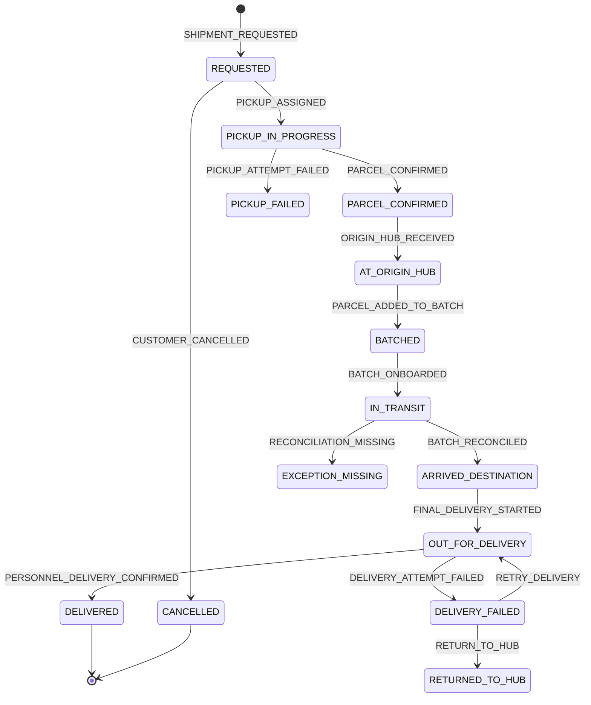

# CERELO V1 USER JOURNEYS & OPERATIONAL STATE MACHINE

> **Document Status:** Authoritative Behavioural Contract & System-Behaviour Specification for Cerelo V1  
> **Pre-requisite References:** `CERELO_PRODUCT_CONTEXT.md` and `CERELO_V1_REQUIREMENTS_FREEZE.md`  
> **Corridor Scope:** Kano ↔ Katsina, Nigeria (Bi-directional)  

---

## A. Behavioural Overview

Cerelo V1's digital system is designed so that **every digital state transition directly represents an authentic, verified physical logistics event**. 

Software states must never advance based on arbitrary timers, estimated travel times, or unverified assumptions. The system manages physical custody handoffs across three distinct operating domains:

```
┌────────────────────────────────────────────────────────────────────────────────────────┐
│                              CERELO V1 PHYSICAL LOGISTICS PATH                         │
├───────────────────────┬─────────────────────────────────┬──────────────────────────────┤
│ 1. Origin Domain      │ 2. Middle-Mile Corridor Domain  │ 3. Destination Domain        │
├───────────────────────┼─────────────────────────────────┼──────────────────────────────┤
│ • Sender Doorstep     │ • Origin Cerelo Hub             │ • Destination Cerelo Hub     │
│ • Personnel Pickup    │ • Consolidation into Batch      │ • Batch QR Scan & Receipt    │
│ • Size Verification   │ • Batch Confirmation & QR Label │ • Parcel QR Reconciliation   │
│ • Receiver Phone Call │ • Passenger Car Onboarding      │ • Route Assignment           │
│ • Confirm Parcel      │ • Intercity Highway Transit     │ • Doorstep Delivery          │
│ • Print Parcel QR     │   (Kano ↔ Katsina)              │ • Receiver Handover & Call   │
└───────────────────────┴─────────────────────────────────┴──────────────────────────────┘
```

---

## B. Actors

### 1. Customer / Sender
* **Definition:** An authenticated customer user operating in the role of parcel sender for a specific shipment.
* **Capabilities:** Requests delivery, selects payment mode, reviews pricing, views tracking status, generates shareable tracking links, cancels pre-custody requests.
* **Boundaries:** Cannot confirm physical custody, alter parcel sizes, build batches, or execute operational state changes.

### 2. Customer / Receiver
* **Definition:** An authenticated (or unauthenticated recipient of a shared link) user operating in the role of parcel receiver for a specific shipment.
* **Capabilities:** Views incoming parcel status, receives notification alerts, optionally taps "Confirm Delivery" upon receiving physical parcel.
* **Boundaries:** Cannot alter pickup details, change payment responsibilities, or access sender profile PII.

### 3. Cerelo Personnel
* **Definition:** Authorized operational field staff assigned to operating hubs (Kano Hub, Katsina Hub).
* **Capabilities:** Attends pickups, verifies parcel sizes, logs receiver pre-confirmation calls, collects physical payments, executes `Confirm Parcel`, prints labels, builds/confirms Batches, marks Batches `Onboarded`, reconciles destination Batches, executes `Going for Delivery`, marks `Delivered`, logs post-delivery calls.
* **Boundaries:** Cannot alter corridor pricing configurations, delete audit trails, or access customer authentication tokens.

### 4. Admin / Operations
* **Definition:** Internal operational managers exercising oversight, exception handling, and configuration control.
* **Capabilities:** Monitors system-wide corridor operations, resolves reconciliation discrepancies, overrides halted exception workflows, manages Personnel accounts, updates price tables, inspects immutable audit logs.

### 5. System
* **Definition:** Automated system worker executing deterministic side-effects in response to authorized actor events.
* **Capabilities:** Propagates customer-facing statuses (e.g. updating shipment status to `In Transit` when Personnel marks a Batch `Onboarded`), dispatches SMS/push notifications, calculates split payment remainders, validates batch membership rules.

---

## C. Core Domain Objects

```
┌────────────────────────────────────────────────────────────────────────────────────────┐
│                                CERELO V1 DOMAIN ENTITIES                               │
├─────────────────┬─────────────────────────────────┬────────────────────────────────────┤
│ Domain Entity   │ Operational Purpose             │ Key Identifiers & Lifecycle State  │
├─────────────────┼─────────────────────────────────┼────────────────────────────────────┤
│ 1. Shipment     │ Door-to-door customer contract  │ UUID, Delivery Code (Human Reference)│
│                 │ representing order agreement.   │ Status: Requested -> Delivered     │
├─────────────────┼─────────────────────────────────┼────────────────────────────────────┤
│ 2. Parcel       │ Physical item entity in custody │ Parcel QR (Encrypted Barcode Label)│
│                 │ storing verified size & weight. │ Status: Unconfirmed -> Handed Over │
├─────────────────┼─────────────────────────────────┼────────────────────────────────────┤
│ 3. Batch        │ Operational container grouping  │ Batch QR (Encrypted Container QR)  │
│                 │ parcels for middle-mile transit.│ Status: Draft -> Reconciled        │
├─────────────────┼─────────────────────────────────┼────────────────────────────────────┤
│ 4. Payment      │ Financial obligation & cash     │ Payment Record (Sender / Receiver) │
│    Obligation   │ collection tracking per party.  │ Status: Pending -> Collected       │
├─────────────────┼─────────────────────────────────┼────────────────────────────────────┤
│ 5. Operational  │ Immutable log of custody changes│ Event ID, ActorID, Timestamp,      │
│    Event        │ and operational actions.        │ Location, Action Payload           │
└─────────────────┴─────────────────────────────────┴────────────────────────────────────┘
```

---

## D. Successful End-to-End Journey (Kano → Katsina)

```
[1. Sender Requests Delivery] (Kano)
         │  Customer inputs pickup/delivery details, selects "Sender Pays" (₦3,000)
         ▼
[2. Personnel Pickup & Verification]
         │  Personnel arrives, verifies parcel size (Small), calls Receiver (Amina)
         ▼
[3. Confirm Parcel Event]
         │  Personnel collects ₦3,000 cash, taps "Confirm Parcel" ──► Generates Parcel QR & Delivery Code (CRL-8821)
         ▼
[4. Origin Hub Consolidation]
         │  Personnel transports parcel to Kano Hub, scans Parcel QR into Batch #104 (Kano -> Katsina)
         ▼
[5. Confirm Batch & Print Batch QR]
         │  Personnel confirms manifest (10 parcels), prints Batch QR label
         ▼
[6. Middle-Mile Onboarding]
         │  Batch loaded into commercial car seat (Kwankwasiyya), Personnel taps "Mark Onboarded"
         │  └──> System automatically updates all 10 shipments to status: "In Transit"
         ▼
[7. Middle-Mile Transit]
         │  Vehicle travels along Kano-Katsina Highway (~2.5 hours)
         ▼
[8. Destination Hub Receipt & Reconciliation] (Katsina)
         │  Katsina Personnel scans Batch QR, scans each physical Parcel QR (10/10 matched)
         │  └──> System updates shipment statuses to: "Arrived Destination City"
         ▼
[9. Final-Mile Out for Delivery]
         │  Katsina Personnel assigns parcel to delivery route, taps "Going for Delivery"
         │  └──> System updates status to: "Out for Delivery"
         ▼
[10. Doorstep Handover & Delivery Completion]
         │  Personnel hands parcel to Receiver (Amina), taps "Mark Delivered"
         │  Personnel immediately calls Sender from doorstep to confirm delivery
         │  └──> System updates status to: "Delivered", notifies Sender via SMS/Push
```

> *Symmetry Note:* The opposite direction (Katsina → Kano) follows the exact same symmetrical workflow, swapping the respective origin and destination hub roles.

---

## E. Customer Journeys

### Journey C-1: Onboarding (Google / Email)
* **Goal:** Authenticate customer and establish profile classification.
* **Flow:** Launch App → Select `Continue with Google` (or `Continue with Email`) → Complete authentication → Select Account Classification (`Individual` or `Business`) → If `Business`, input `Business / Shop Name` → System saves profile → User lands on `Home` tab.
* **Returning User Flow:** Launch App → Authenticated session detected → Lands directly on `Home` tab.

### Journey C-2: Send a Package (Intercity Flow)
* **Goal:** Create a new intercity parcel delivery request.
* **Flow:** Tap "Send a Package" on Home → Form Step 1: Input Sender Pickup Address & Origin City (Kano) → Form Step 2: Input Receiver Name, Phone, Delivery Address, & Destination City (Katsina) → Form Step 3: Select Estimated Size (`Small`/`Medium`/`Large`) & Description → Form Step 4: Select Payment Responsibility (`Sender Pays`, `Receiver Pays`, or `Split Payment`) → Review Summary Screen → Tap "Submit Request" → System creates shipment record in `REQUESTED` state and displays Delivery Code.

### Journey C-3: Track Sent Parcel
* **Goal:** Sender monitors progress of active outgoing parcel.
* **Flow:** Open Customer App → Navigate to `Shipments` tab → Select filter tab **"Parcels Sent"** → Tap target shipment card → View milestone timeline (7 statuses), Delivery Code, current location stage, and payment collection status.

### Journey C-4: Access Received Parcel
* **Goal:** Receiver tracks incoming parcel assigned to their phone number.
* **Flow:** Open Customer App → Navigate to `Shipments` tab → Select filter tab **"Parcels Received"** → View incoming shipment details, origin city, masked sender details, and live milestone status.

### Journey C-5: Shared Delivery Link Access
* **Goal:** Allow receiver or external party to view tracking status via shared link.
* **Flow:** Sender taps "Share Link" in app → Sends URL (`https://cerelo.app/track/{DeliveryCode}`) via WhatsApp/SMS to Receiver → Receiver taps URL:
  * *If Cerelo App Installed:* Deep-links directly to shipment details in "Parcels Received".
  * *If Cerelo App NOT Installed:* Opens mobile web landing page showing tracking timeline and download link.

### Journey C-6: Customer Pre-Custody Cancellation
* **Goal:** Sender cancels shipment request before Personnel collects parcel.
* **Flow:** Sender opens shipment detail page (Status must be `REQUESTED`) → Taps "Cancel Request" → System verifies parcel is not yet confirmed (`PARCEL_CONFIRMED`) → System transitions status to `CANCELLED` → Pickup task removed from Personnel queue.

### Journey C-7: Receiver Delivery Confirmation (Optional)
* **Goal:** Receiver endorses successful delivery receipt in app.
* **Flow:** Receiver opens received shipment detail (Status: `DELIVERED`) → Taps "Confirm Delivery" → System logs `RECEIVER_DELIVERY_CONFIRMED` event as customer endorsement.

---

## F. Personnel Journeys

### Journey P-1: Pickup Attendance & Parcel Inspection
* **Flow:** Personnel opens task queue → Accepts pickup task → Navigates to Sender address → Inspects physical parcel dimensions/weight → Compares against sender's selected size (`Small`) → If actual size is `Medium`, Personnel selects `Medium` in app → System recalculates delivery charge and updates shipment summary.

### Journey P-2: Receiver Pre-Verification Call
* **Flow:** Personnel opens active pickup task → Taps "Call Receiver" → Mobile dialer opens with receiver's phone number → Personnel conducts verification call confirming receiver identity, address, and willingness to pay (if `Receiver Pays`/`Split`) → Personnel returns to app and logs call outcome (`VERIFICATION_SUCCESSFUL`).

### Journey P-3: Pickup Payment Collection & Confirm Parcel
* **Flow:** Personnel checks payment responsibility → If `Sender Pays` or `Split Payment`, collects cash/transfer from sender → Personnel records `Amount Collected` and `Payment Method` in app → Personnel taps **"CONFIRM PARCEL"** → System transitions status to `PARCEL_CONFIRMED` and generates Parcel QR + Delivery Code.

### Journey P-4: Label Printing & Physical Attachment
* **Flow:** Personnel taps "Print Label" on confirmed parcel screen → System displays QR label interface → Personnel selects label dimension (e.g. 4x6 thermal sticker) → Sends print job to portable/hub printer → Affixes physical printed QR sticker securely to parcel.

### Journey P-5: Origin Hub Processing & Batch Building
* **Flow:** Personnel arrives at Origin Hub with confirmed parcels → Selects "Create Batch" → Selects corridor route (Kano → Katsina) → System opens camera scanner → Personnel scans Parcel QR Code on each physical parcel (or types Delivery Code if QR damaged) → System adds parcel to batch manifest → Personnel reviews list → Taps "Confirm Batch" → System locks manifest and generates Batch QR Code.

### Journey P-6: Middle-Mile Transport Onboarding
* **Flow:** Personnel assigns confirmed Batch to transport vehicle (e.g. passenger car driver) → Records driver phone and vehicle plate → When car physically departs, Personnel taps **"MARK BATCH ONBOARDED"** → System records onboarding event and automatically propagates customer status `IN_TRANSIT` to all contained parcels.

### Journey P-7: Destination Batch Receipt & QR Reconciliation
* **Flow:** Middle-mile transport arrives at Destination Hub → Destination Personnel opens app and taps "Receive Batch" → Camera scanner opens → Personnel scans physical **Batch QR Code** → App loads expected parcel manifest list → Personnel physically scans each parcel's **Parcel QR Code** → System checks off items → If 100% matched, Personnel taps "Reconciliation Complete" → System updates all contained parcel statuses to `ARRIVED_DESTINATION`.

### Journey P-8: Final-Mile Delivery Execution & Doorstep Handover
* **Flow:** Destination Personnel selects reconciled parcels for route → Taps **"Going for Delivery"** → System updates customer status to `OUT_FOR_DELIVERY` → Personnel arrives at Receiver doorstep → Verifies receiver identity → Collects remaining payment (if `Receiver Pays`/`Split`) → Records payment in app → Hands physical parcel to receiver → Taps **"Mark Delivered"** → Personnel immediately dials Sender phone from doorstep to confirm delivery → Logs "Sender Call Completed" in app → System updates status to `DELIVERED`.

---

## G. Payment Journeys

```
┌────────────────────────────────────────────────────────────────────────────────────────┐
│                              CERELO V1 PAYMENT FLOW MATRIX                             │
├─────────────────┬──────────────────────────────────┬───────────────────────────────────┤
│ Payment Mode    │ Collection Stage 1 (Pickup)      │ Collection Stage 2 (Doorstep)     │
├─────────────────┼──────────────────────────────────┼───────────────────────────────────┤
│ 1. Sender Pays  │ Personnel collects 100% fee from │ No payment required from Receiver.│
│    (100%)       │ Sender prior to Confirm Parcel.  │                                   │
├─────────────────┼──────────────────────────────────┼───────────────────────────────────┤
│ 2. Receiver Pays│ No payment required from Sender. │ Personnel collects 100% fee from  │
│    (100%)       │                                  │ Receiver prior to Handover.       │
├─────────────────┼──────────────────────────────────┼───────────────────────────────────┤
│ 3. Split        │ Personnel collects agreed Sender │ Personnel collects remaining fee  │
│    Payment      │ portion from Sender at pickup.   │ from Receiver at doorstep handover│
└─────────────────┴──────────────────────────────────┴───────────────────────────────────┘
```

### Payment Failure Handling:
* **Pickup Payment Failure:** If Sender cannot pay required fee at pickup, Personnel selects "Payment Uncollected". System transitions shipment to `PICKUP_ON_HOLD_PAYMENT`. `Confirm Parcel` action is BLOCKED.
* **Doorstep Payment Failure:** If Receiver refuses or cannot pay required fee at doorstep, Personnel selects "Doorstep Payment Refused". Handover is BLOCKED. Personnel retains physical parcel, returns it to Destination Hub, and system transitions status to `DELIVERY_FAILED_PAYMENT_REFUSED`.

---

## H. Exception Journeys

### Journey E-1: Sender Unavailable at Pickup
* **Trigger:** Personnel arrives at pickup address but Sender is absent/unreachable.
* **Action:** Personnel logs "Sender Unavailable" in app → System sets shipment state to `PICKUP_FAILED_SENDER_UNAVAILABLE` → Sends notification to Sender to reschedule or cancel.

### Journey E-2: Receiver Pre-Verification Call Fails
* **Trigger:** Personnel calls Receiver at pickup, but phone is invalid, unanswered, or Receiver denies ordering parcel.
* **Action:** Personnel logs "Receiver Verification Failed" → System sets shipment state to `PICKUP_ON_HOLD_RECEIVER_UNREACHABLE` → `Confirm Parcel` button remains LOCKED.

### Journey E-3: Sender Rejects Parcel Size/Price Correction
* **Trigger:** Personnel corrects parcel size from `Small` to `Medium` (increasing price), but Sender refuses to pay revised fee.
* **Action:** Personnel logs "Size Correction Rejected" → Pickup is aborted → System sets shipment state to `CANCELLED_PRICE_DISPUTE` → No custody accepted.

### Journey E-4: Invalid Parcel Added to Batch
* **Trigger:** Personnel attempts to scan a parcel into a Kano→Katsina batch, but parcel is assigned to opposite route or already onboarded.
* **Action:** App displays red error alert (`INVALID_BATCH_ITEM`) and plays rejection sound → Item blocked from entering batch manifest.

### Journey E-5: Batch Destination Reconciliation Discrepancy (Missing Parcel)
* **Trigger:** Batch manifest expects 10 parcels, but Destination Personnel only physically scans 9 parcels.
* **Action:** System displays discrepancy warning → Personnel taps "Report Missing Item" → Missing parcel state updated to `MISSING_IN_TRANSIT` → Exception alert sent to Admin/Operations → Remaining 9 matched parcels proceed to `ARRIVED_DESTINATION`.

### Journey E-6: Receiver Unavailable at Doorstep
* **Trigger:** Personnel arrives at destination doorstep, but Receiver does not answer call or door.
* **Action:** Personnel logs "Receiver Unavailable at Doorstep" → System sets status to `DELIVERY_ATTEMPT_1_FAILED` → Parcel returned to Destination Hub holding area for retry.

### Journey E-7: Temporary Mobile Network Failure during QR Scan
* **Trigger:** Personnel scans Parcel QR in an area with poor cellular connectivity.
* **Action:** Personnel app stores scan locally in encrypted queue (`OFFLINE_PENDING_SYNC`) → Displays yellow banner ("Saved Offline") → System automatically syncs payload with server upon network restoration.

---

## I. Customer-Facing Shipment Status Model

The Customer Mobile App SHALL display tracking progress using strictly these **7 customer-facing status milestones**:

```
[1. Requested] ──► [2. Parcel Confirmed] ──► [3. At Origin Hub] ──► [4. In Transit]
                                                                          │
[7. Delivered] ◄── [6. Out for Delivery] ◄── [5. Arrived Destination] ◄──┘
```

| # | Customer Status | Operational Trigger Event | Meaning to Customer |
| :-: | :--- | :--- | :--- |
| **1** | **Requested** | `SHIPMENT_REQUESTED` | Delivery request received; Cerelo Personnel assigned for pickup. |
| **2** | **Parcel Confirmed** | `PARCEL_CONFIRMED` | Personnel physically inspected parcel, verified receiver, collected pickup payment, and accepted custody. |
| **3** | **At Origin Hub** | `ORIGIN_HUB_RECEIVED` | Parcel arrived at origin hub and is being consolidated into a Batch. |
| **4** | **In Transit** | `BATCH_ONBOARDED` | Consolidated Batch has physically departed on middle-mile transport along the Kano ↔ Katsina highway. |
| **5** | **Arrived Destination** | `BATCH_RECONCILED` | Parcel arrived at destination city hub and passed physical QR reconciliation. |
| **6** | **Out for Delivery** | `FINAL_DELIVERY_STARTED` | Destination Personnel loaded parcel onto delivery vehicle and is en route to receiver doorstep. |
| **7** | **Delivered** | `PERSONNEL_DELIVERY_CONFIRMED` | Parcel physically handed to receiver at doorstep; remaining payment collected; sender notified. |

---

## J. Internal Shipment State Machine



### Internal State Definitions & Transition Matrix

| Internal State | Definition | Valid Next States | Terminal? |
| :--- | :--- | :--- | :---: |
| `REQUESTED` | Order request submitted by sender; awaiting pickup. | `PICKUP_IN_PROGRESS`, `CANCELLED` | No |
| `PICKUP_IN_PROGRESS` | Personnel assigned and traveling/attending sender pickup. | `PARCEL_CONFIRMED`, `PICKUP_FAILED` | No |
| `PARCEL_CONFIRMED` | Physical parcel size verified, receiver called, payment collected, custody accepted. | `AT_ORIGIN_HUB` | No |
| `AT_ORIGIN_HUB` | Parcel physically present at origin hub. | `BATCHED` | No |
| `BATCHED` | Parcel assigned to a confirmed origin Batch manifest. | `IN_TRANSIT`, `AT_ORIGIN_HUB` (if removed) | No |
| `IN_TRANSIT` | Batch onboarded on middle-mile transport; en route between cities. | `ARRIVED_DESTINATION`, `EXCEPTION_MISSING` | No |
| `ARRIVED_DESTINATION` | Batch received & parcel reconciled at destination hub. | `OUT_FOR_DELIVERY` | No |
| `OUT_FOR_DELIVERY` | Destination Personnel en route to receiver doorstep. | `DELIVERED`, `DELIVERY_FAILED` | No |
| `DELIVERED` | Parcel handed over at doorstep; post-delivery sender call completed. | None | **YES** |
| `CANCELLED` | Order cancelled prior to physical custody acceptance. | None | **YES** |
| `DELIVERY_FAILED` | Doorstep attempt failed (receiver absent/refused payment). | `OUT_FOR_DELIVERY`, `RETURNED_TO_HUB` | No |
| `RETURNED_TO_HUB` | Parcel held at destination hub following failed delivery attempt. | `OUT_FOR_DELIVERY`, `RETURNED_TO_SENDER` | No |
| `EXCEPTION_MISSING` | Parcel missing during destination batch reconciliation. | `ARRIVED_DESTINATION` (if found) | No |

---

## K. Parcel State Machine

The physical **Parcel** lifecycle tracks physical item custody independently from the top-level Shipment order contract:

```
[UNCONFIRMED] ──► [IN_CERELO_CUSTODY] ──► [ORIGIN_HUB_STAGED] ──► [BATCH_LOCKED]
                                                                        │
[HANDED_OVER] ◄── [FINAL_DELIVERY_STAGED] ◄── [DESTINATION_HUB_STAGED] ◄── [CORRIDOR_TRANSIT]
```

1. `UNCONFIRMED`: Parcel details exist digitally, but item is in Sender's physical possession.
2. `IN_CERELO_CUSTODY`: Personnel accepted physical item at pickup doorstep.
3. `ORIGIN_HUB_STAGED`: Parcel physically resting in origin hub sorting area.
4. `BATCH_LOCKED`: Parcel sealed into a confirmed Batch manifest container.
5. `CORRIDOR_TRANSIT`: Parcel physically traveling inside middle-mile vehicle trunk.
6. `DESTINATION_HUB_STAGED`: Parcel physically scanned and resting at destination hub.
7. `FINAL_DELIVERY_STAGED`: Parcel physically in destination Personnel delivery bag/bike.
8. `HANDED_OVER`: Parcel physically transferred to Receiver.

---

## L. Batch State Machine

A **Batch** container lifecycle governs the consolidation and transport of multiple parcels:

```
[DRAFT] ──► [CONFIRMED] ──► [ONBOARDED] ──► [DESTINATION_RECEIVED] ──► [RECONCILED] ──► [CLOSED]
```

* `DRAFT`: Batch record created at origin hub; Personnel actively scanning/adding parcels.
* `CONFIRMED`: Manifest locked by Personnel; Batch QR Code generated; ready for onboarding.
* `ONBOARDED`: Batch loaded into passenger car; middle-mile transport departed.
* `DESTINATION_RECEIVED`: Batch QR scanned by Destination Hub Personnel upon vehicle arrival.
* `RECONCILIATION_IN_PROGRESS`: Personnel scanning individual Parcel QRs against expected manifest.
* `RECONCILED`: 100% of expected parcels matched and verified at destination hub.
* `CLOSED`: All contained parcels assigned to final-mile delivery routes; batch container archived.

---

## M. Payment State Model

Payment tracking is split into two independent obligation lifecycles (`Sender Payment` and `Receiver Payment`) to accurately support `Split Payment` modes without using single overloaded status flags:

```
Sender Obligation:   [NOT_REQUIRED] | [PENDING] ──► [COLLECTED] (At Pickup)
Receiver Obligation: [NOT_REQUIRED] | [PENDING] ──► [COLLECTED] (At Doorstep)
```

| Payment Mode | Sender Obligation State | Receiver Obligation State | Combined Payment Status |
| :--- | :--- | :--- | :--- |
| **Sender Pays (100%)** | `COLLECTED` (at pickup) | `NOT_REQUIRED` | `FULLY_PAID` |
| **Receiver Pays (100%)**| `NOT_REQUIRED` | `PENDING` → `COLLECTED` (at doorstep) | `PARTIALLY_PAID` → `FULLY_PAID` |
| **Split Payment** | `COLLECTED` (at pickup) | `PENDING` → `COLLECTED` (at doorstep) | `PARTIALLY_PAID` → `FULLY_PAID` |

---

## N. Event Taxonomy

```
┌────────────────────────────────────────────────────────────────────────────────────────┐
│                              CERELO V1 EVENT TAXONOMY                                  │
├─────────────────────┬─────────────────────────────────┬────────────────────────────────┤
│ Category            │ Event Identifier                │ Primary Triggering Actor       │
├─────────────────────┼─────────────────────────────────┼────────────────────────────────┤
│ 1. Customer         │ `ACCOUNT_REGISTERED`            │ Customer                       │
│                     │ `SHIPMENT_REQUESTED`            │ Customer                       │
│                     │ `REQUEST_CANCELLED`             │ Customer                       │
│                     │ `RECEIVER_DELIVERY_CONFIRMED`   │ Customer / Receiver            │
├─────────────────────┼─────────────────────────────────┼────────────────────────────────┤
│ 2. Pickup           │ `PICKUP_TASK_ASSIGNED`          │ System / Admin                 │
│                     │ `PARCEL_SIZE_CORRECTED`         │ Cerelo Personnel               │
│                     │ `RECEIVER_VERIFIED`             │ Cerelo Personnel               │
│                     │ `SENDER_PAYMENT_COLLECTED`      │ Cerelo Personnel               │
│                     │ `PARCEL_CONFIRMED`              │ Cerelo Personnel               │
│                     │ `PARCEL_QR_PRINTED`             │ Cerelo Personnel               │
├─────────────────────┼─────────────────────────────────┼────────────────────────────────┤
│ 3. Origin Hub       │ `ORIGIN_HUB_RECEIVED`           │ Cerelo Personnel               │
│                     │ `BATCH_CREATED`                 │ Cerelo Personnel               │
│                     │ `PARCEL_ADDED_TO_BATCH`         │ Cerelo Personnel               │
│                     │ `BATCH_CONFIRMED`               │ Cerelo Personnel               │
├─────────────────────┼─────────────────────────────────┼────────────────────────────────┤
│ 4. Middle-Mile      │ `BATCH_ONBOARDED`               │ Cerelo Personnel               │
│                     │ `TRANSIT_DELAY_LOGGED`          │ Cerelo Personnel / Admin       │
├─────────────────────┼─────────────────────────────────┼────────────────────────────────┤
│ 5. Destination Hub  │ `BATCH_DESTINATION_RECEIVED`    │ Cerelo Personnel               │
│                     │ `PARCEL_RECONCILED`             │ Cerelo Personnel               │
│                     │ `RECONCILIATION_COMPLETED`      │ Cerelo Personnel               │
│                     │ `RECONCILIATION_DISCREPANCY`    │ Cerelo Personnel / System      │
├─────────────────────┼─────────────────────────────────┼────────────────────────────────┤
│ 6. Final Mile       │ `FINAL_DELIVERY_STARTED`        │ Cerelo Personnel               │
│                     │ `RECEIVER_PAYMENT_COLLECTED`    │ Cerelo Personnel               │
│                     │ `PERSONNEL_DELIVERY_CONFIRMED`  │ Cerelo Personnel               │
│                     │ `POST_DELIVERY_SENDER_CALLED`   │ Cerelo Personnel               │
└─────────────────────┴─────────────────────────────────┴────────────────────────────────┘
```

---

## O. Transition Matrix

| Entity | Source State | Triggering Event | Actor | Mandatory Preconditions | Target State | Customer Effect |
| :--- | :--- | :--- | :--- | :--- | :--- | :--- |
| **Shipment** | `REQUESTED` | `PICKUP_ASSIGNED` | System/Admin | Valid pickup task created. | `PICKUP_IN_PROGRESS` | Displays "Personnel Assigned" |
| **Shipment** | `PICKUP_IN_PROGRESS` | `PARCEL_CONFIRMED` | Personnel | Size verified, Receiver called, Pickup payment collected. | `PARCEL_CONFIRMED` | Displays "Parcel Confirmed" |
| **Shipment** | `PARCEL_CONFIRMED` | `ORIGIN_HUB_RECEIVED`| Personnel | Physical parcel scanned at Hub. | `AT_ORIGIN_HUB` | Displays "At Origin Hub" |
| **Batch** | `DRAFT` | `BATCH_CONFIRMED` | Personnel | Minimum 1 parcel added; manifest reviewed. | `CONFIRMED` | None (Internal) |
| **Shipment** | `AT_ORIGIN_HUB` | `BATCH_ONBOARDED` | Personnel | Batch confirmed & loaded on transport. | `IN_TRANSIT` | Displays "In Transit" |
| **Batch** | `ONBOARDED` | `BATCH_DEST_RECEIVED`| Personnel | Destination Personnel scans Batch QR. | `DESTINATION_RECEIVED`| None (Internal) |
| **Shipment** | `IN_TRANSIT` | `RECONCILIATION_COMPLETED`| Personnel | 100% of batch parcels scanned & matched. | `ARRIVED_DESTINATION`| Displays "Arrived Destination" |
| **Shipment** | `ARRIVED_DESTINATION`| `FINAL_DELIVERY_STARTED`| Personnel | Parcel assigned to final-mile route. | `OUT_FOR_DELIVERY` | Displays "Out for Delivery" |
| **Shipment** | `OUT_FOR_DELIVERY` | `PERSONNEL_DELIVERY_CONFIRMED`| Personnel | Doorstep handover complete, remaining payment collected. | `DELIVERED` | Displays "Delivered" |

---

## P. Invalid Transition Rules

The software architecture MUST strictly reject the following invalid state transitions:

1. ❌ **`REQUESTED` → `DELIVERED`:** Block direct completion without physical custody, batching, and reconciliation.
2. ❌ **Unconfirmed Parcel → `PARCEL_ADDED_TO_BATCH`:** Block adding a parcel to a batch before `PARCEL_CONFIRMED` is executed.
3. ❌ **Duplicate Batch Membership:** Block adding a parcel to a batch if it already belongs to another active/onboarded batch.
4. ❌ **`DRAFT` Batch → `BATCH_ONBOARDED`:** Block onboarding a batch before executing `BATCH_CONFIRMED` (which locks the manifest and generates the Batch QR).
5. ❌ **`IN_TRANSIT` → `DELIVERED`:** Block jumping from transit to delivery without passing destination QR reconciliation (`ARRIVED_DESTINATION`).
6. ❌ **Unpaid Pickup → `PARCEL_CONFIRMED`:** Block parcel confirmation if `Sender Pays` or `Split` payment is uncollected.
7. ❌ **Unpaid Doorstep → `PERSONNEL_DELIVERY_CONFIRMED`:** Block operational delivery completion if `Receiver Pays` or `Split` remaining payment is uncollected.

---

## Q. Actor Permission Matrix

```
┌────────────────────────────────────────────────────────────────────────────────────────┐
│                              CERELO V1 PERMISSION MATRIX                               │
├────────────────────────────────┬──────────┬──────────┬───────────┬───────────┬─────────┤
│ Action / Operational Event     │ Sender   │ Receiver │ Personnel │ Ops/Admin │ System  │
├────────────────────────────────┼──────────┼──────────┼───────────┼───────────┼─────────┤
│ 1. Create Shipment Request     │    ✓     │    —     │     —     │     —     │    —    │
│ 2. Cancel Request (Pre-custody)│    ✓     │    —     │     —     │     ✓     │    —    │
│ 3. Correct Parcel Size         │    —     │    —     │     ✓     │     ✓     │    —    │
│ 4. Record Pickup Payment       │    —     │    —     │     ✓     │     ✓     │    —    │
│ 5. Execute "Confirm Parcel"    │    —     │    —     │     ✓     │     —     │    —    │
│ 6. Build & Confirm Batch       │    —     │    —     │     ✓     │     ✓     │    —    │
│ 7. Mark Batch "Onboarded"      │    —     │    —     │     ✓     │     ✓     │    —    │
│ 8. Reconcile Destination Batch │    —     │    —     │     ✓     │     ✓     │    —    │
│ 9. Execute "Going for Delivery"│    —     │    —     │     ✓     │     —     │    —    │
│ 10. Record Doorstep Payment    │    —     │    —     │     ✓     │     ✓     │    —    │
│ 11. Execute "Mark Delivered"   │    —     │    —     │     ✓     │     —     │    —    │
│ 12. Confirm Delivery (App Tap) │    —     │    ✓     │     —     │     —     │    —    │
│ 13. Override Exception Status  │    —     │    —     │     —     │     ✓     │    —    │
└────────────────────────────────┴──────────┴──────────┴───────────┴───────────┴─────────┘
```

---

## R. Chain of Custody Model

```
┌────────────────────────────────────────────────────────────────────────────────────────┐
│                              CHAIN OF CUSTODY RESPONSIBILITY                           │
├──────────────────────────┬───────────────────────────┬─────────────────────────────────┤
│ Stage                    │ Custody Holder            │ Verification / Handoff Evidence │
├──────────────────────────┼───────────────────────────┼─────────────────────────────────┤
│ 1. Pre-Pickup            │ Customer / Sender         │ Shipment Request Record         │
│ 2. Pickup Doorstep       │ Pickup Cerelo Personnel   │ `PARCEL_CONFIRMED` + QR Printed │
│ 3. Origin Hub            │ Kano/Katsina Hub Ops      │ `ORIGIN_HUB_RECEIVED` Scan      │
│ 4. Middle-Mile Highway   │ Assigned Transport Driver │ `BATCH_ONBOARDED` Manifest Lock │
│ 5. Destination Hub       │ Katsina/Kano Hub Ops      │ `PARCEL_RECONCILED` QR Scan     │
│ 6. Final-Mile Delivery   │ Delivery Cerelo Personnel │ `FINAL_DELIVERY_STARTED` Log    │
│ 7. Post-Handover         │ Customer / Receiver       │ `PERSONNEL_DELIVERY_CONFIRMED`  │
└──────────────────────────┴───────────────────────────┴─────────────────────────────────┘
```

---

## S. Notification Mapping

```
┌─────────────────────────┬───────────┬──────────────────────────────────┬──────────────┐
│ Triggering Event        │ Recipient │ Message Content Summary          │ Channel      │
├─────────────────────────┼───────────┼──────────────────────────────────┼──────────────┤
│ `SHIPMENT_REQUESTED`    │ Sender    │ Request received. Code: CRL-XXXX │ Push + SMS   │
│ `PARCEL_CONFIRMED`      │ Sender    │ Parcel collected & confirmed.    │ Push         │
│ `BATCH_ONBOARDED`       │ Sender    │ Parcel is In Transit to [City].  │ Push + SMS   │
│ `BATCH_ONBOARDED`       │ Receiver  │ Incoming parcel from [Sender].   │ SMS (Link)   │
│ `BATCH_RECONCILED`      │ Receiver  │ Parcel arrived at [City] Hub.    │ Push         │
│ `FINAL_DELIVERY_STARTED`│ Receiver  │ Out for delivery! Arriving soon. │ Push + SMS   │
│ `DELIVERED`             │ Sender    │ Delivered! Personnel calling.    │ Push + SMS   │
└─────────────────────────┴───────────┴──────────────────────────────────┴──────────────┘
```

---

## T. Manual SOP Event Mapping

To maintain high-trust operations without expensive telephony integrations, the software explicitly records two manual phone call events:

1. **`RECEIVER_VERIFICATION_CALL_LOGGED`:** Recorded at pickup. Form requires Personnel to select `[x] Call Conducted`, `[x] Receiver Identity Confirmed`, `[x] Address Verified`. Required to unlock "Confirm Parcel".
2. **`POST_DELIVERY_SENDER_CALL_LOGGED`:** Recorded post-handover at doorstep. Form requires Personnel to select `[x] Sender Called from Doorstep`. Required to close final delivery task.

---

## U. Correction & Recovery Rules

* **Size Correction Before Confirmation:** Personnel can correct parcel size during pickup. System recalculates price and updates shipment record.
* **Size Correction After Confirmation (Hub Stage):** Requires Admin override. Hub Personnel flags "Size Mismatch at Hub", Admin approves price adjustment, and sender is notified.
* **Batch Membership Mistake (Draft Stage):** Personnel can remove accidentally scanned parcel from a `DRAFT` Batch.
* **Batch Membership Mistake (Confirmed Stage):** Personnel cannot edit manifest. Must tap "Unbind Batch", return batch to `DRAFT`, edit items, and re-confirm.

---

## V. Duplicate / Concurrency Behaviour

* **Duplicate QR Scans:** Scanning the same Parcel QR twice during batch building or destination reconciliation triggers a soft warning ("Item Already Scanned") and ignores the duplicate scan.
* **Duplicate "Mark Delivered" Taps:** System evaluates request idempotency using `ShipmentID`. Secondary requests return `200 OK` with existing `DELIVERED` state without duplicating notifications.
* **Concurrent Batch Assignment:** Database transaction locks prevent a parcel from being assigned to two simultaneous batch creation requests.

---

## W. Cancellation & Failed Delivery Rules

### Pre-Custody Cancellation
If Sender cancels while shipment is in `REQUESTED` state:
* Status changes to `CANCELLED`.
* Task removed from Personnel queue. No fees incurred.

### Post-Custody Return Workflow (Failed Delivery)
If delivery fails at doorstep (Receiver unavailable / payment refused):
1. Status changes to `DELIVERY_FAILED`.
2. Parcel physically returns to Destination Hub holding area (`RETURNED_TO_HUB`).
3. System holds parcel for 24-hour retry window before initiating return-to-sender logistics.

---

## X. Locked Behavioural Decisions

1. Digital states strictly represent verified physical events. No automated timer progression.
2. Tracking is milestone-based only (7 customer statuses). Live GPS maps are excluded.
3. Pickup requires mandatory physical size inspection and pre-verification phone call to Receiver.
4. "Confirm Parcel" generates Parcel QR label and Delivery Code.
5. Batches group parcels for middle-mile transport; Batch QRs locked upon confirmation.
6. Marking Batch "Onboarded" propagates `IN_TRANSIT` customer status.
7. Destination hub QR reconciliation is mandatory before final delivery.
8. Physical payment collection is recorded by Personnel at pickup or delivery.
9. Personnel "Mark Delivered" completes operational delivery; Receiver app confirmation is optional.
10. Personnel calls Sender from doorstep post-handover.

---

## Y. Founder Decisions Still Required

| # | Issue | Options | Recommended Option | Technical Architecture Impact |
| :-: | :--- | :--- | :--- | :--- |
| **1** | **Parcel Size Category Boundaries** | A. Weight-based (Small <= 3kg, Medium <= 10kg)<br>B. Volume/Box-based | **Option A (Weight Tiers):** Clear, objective boundary. | Minor schema constraint definition. |
| **2** | **Split Payment Allocation Rule** | A. Fixed 50/50 split<br>B. Customizable Sender Amount | **Option B (Custom Sender Fee):** Senders specify fixed subsidy. | Payment calculation logic in API. |
| **3** | **Doorstep Refusal Holding Policy** | A. 24h Hub Hold for retry<br>B. Immediate Return to Kano | **Option A (24h Hub Hold):** Gives receiver second chance to pay. | Retry workflow state logic. |
| **4** | **Primary Delivery Completion Trigger** | A. Personnel "Delivered" mark completes order<br>B. Mandatory Receiver app code | **Option A:** Personnel mark completes; Receiver app tap is optional. | State machine closure condition. |

---

## Z. Behavioural Definition of Done

### STATE MACHINE SPECIFICATION COMPLETION CHECKLIST
- [x] All 7 customer-facing tracking milestone statuses defined.
- [x] Complete internal state machines specified for Shipment, Parcel, Batch, and Payment entities.
- [x] Full event taxonomy catalogued across Customer, Pickup, Hub, Transit, Destination, and Delivery phases.
- [x] Pre-conditions, triggering events, actors, and post-conditions defined for all valid state transitions.
- [x] Invalid state transitions explicitly identified and blocked.
- [x] Role-based permission matrix mapped across all major actions.
- [x] Chain of custody handoffs established from doorstep to doorstep.
- [x] Exception branches defined for pickup failure, size dispute, batch discrepancy, and doorstep payment refusal.

**DECLARATION:** The behavioural specification for Cerelo V1 is **COMPLETE AND FROZEN**. Technical architecture and database schema design may now proceed safely.

---
*End of Cerelo V1 User Journeys & Operational State Machine Specification.*
