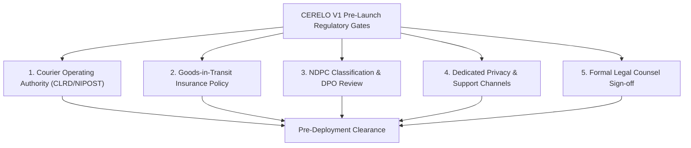

# CERELO V1 — Regulatory & Licensing Readiness Assessment

> **Document Status**: INTERNAL REGULATORY ASSESSMENT — NOT FOR PUBLIC RELEASE  
> **Applicable Regulatory Authorities**: 
> 1. Courier and Logistics Regulatory Department (CLRD) / Nigerian Postal Services (NIPOST)
> 2. Nigeria Data Protection Commission (NDPC)
> 3. Federal Competition and Consumer Protection Commission (FCCPC)  
> **Last Updated**: August 2026

---

## 1. Classification Methodology

Every regulatory domain is classified using the standard project governance framework:
- `[VERIFIED FACT]`: Proven by actual repository code, database schema, or locked V1 product freeze.
- `[CURRENT LAW / REGULATORY REQUIREMENT]`: Grounded in authoritative Nigerian legislation or published regulatory guidance.
- `[CERELO MANAGEMENT DECISION REQUIRED]`: Commercial or operational policy choice requiring executive sign-off.
- `[LEGAL COUNSEL REVIEW REQUIRED]`: Legal interpretation or contractual drafting requiring formal legal counsel opinion.
- `[IMPLEMENTATION REQUIRED]`: Technical, operational, or communication channel capability that must be built before launch.

---

## 2. Courier & Logistics Licensing (NIPOST / CLRD)

| Area | Regulatory Finding & Legal Grounding | Required Action | Status Classification |
|:---|:---|:---|:---|
| **Courier Operating License** | Operating an intercity parcel delivery service for third-party senders for a fee in Nigeria requires a valid courier/logistics operating license issued by NIPOST under the Courier and Logistics Services Operations Regulations. Because CERELO V1 operates exclusively across Kano State and Katsina State (both within the North-West geopolitical zone), the **Regional Courier / Logistics Licence** is the relevant category to evaluate. | Management must verify whether CERELO will operate under its own direct Regional Courier Licence or through an accredited licensed partner framework before commercial operations commence. | `REGULATORY REQUIREMENT IDENTIFIED — LICENCE STATUS / CATEGORY MUST BE CONFIRMED WITH CLRD BEFORE COMMERCIAL OPERATIONS` |
| **Goods-in-Transit Insurance** | CLRD licensing regulations require courier/logistics operators to maintain adequate Goods-in-Transit (GIT) insurance coverage for consignments under their care. | Procure and execute a formal Goods-in-Transit insurance policy covering corridor cargo before launch. *(Note: CERELO must not advertise "Insured Deliveries" to customers until the policy is active and claim limits are established).* | `REGULATORY / PRE-LAUNCH ACTION ITEM` |
| **Waybill & Consignment Identification** | Regulations require every physical parcel to carry an auditable consignment reference. | Fulfilled via the unique Base32 **Delivery Code (`CRL-XXXX-XXXX`)** and QR tracking tokens. | `[VERIFIED FACT]` / `[CURRENT LAW / REGULATORY REQUIREMENT]` |
| **Prohibited Goods Handling** | Postal and transport security regulations prohibit the carriage of explosives, firearms, narcotics, hazardous chemicals, and contraband. | Personnel visually inspect parcel exteriors and declarations at pickup. A formal company prohibited-items catalog must be approved. | `[CURRENT LAW / REGULATORY REQUIREMENT]` |
| **Complaints & Customer Redress Desk** | Courier regulations require operators to maintain an established customer care and dispute handling facility. | Deploy and monitor a dedicated operational support channel (`support@cerelonet.com`). | `[IMPLEMENTATION REQUIRED]` |

---

## 3. Data Protection Compliance (NDPA 2023 & NDPC GAID 2025)

| Area | Regulatory Finding & Legal Grounding | Required Action | Status Classification |
|:---|:---|:---|:---|
| **Data Controller of Major Importance (DCMI) Status** | Under NDPA 2023 Section 44 and GAID 2025, organizations are classified into Ultra High Level (UHL), Extra High Level (EHL), or Ordinary High Level (OHL) based on multiple factors including processing volume, data sensitivity, systemic importance, and critical infrastructure reliance—not user count alone. | Management and privacy counsel must assess CERELO's 12-month projected processing volume and systemic risk profile to determine specific DCMI classification. | `NDPC CLASSIFICATION — ASSESSMENT PENDING` |
| **Data Protection Officer (DPO) Designation** | Section 32 of the NDPA mandates designating a Data Protection Officer if required by the controller's classification, nature of processing, or systematic monitoring activities. | Privacy counsel must confirm whether CERELO's operational profile triggers a mandatory internal DPO or external DPCO designation. | `DPO REQUIREMENT — CLASSIFICATION / LEGAL REVIEW PENDING` |
| **Compliance Audit Returns (CAR) Filing** | Data controllers of major importance in specific regulatory tiers are required to conduct an annual data protection audit through a licensed DPCO and submit a Compliance Audit Return to the NDPC. | Confirm whether CERELO's eventual DCMI tier triggers the annual CAR filing obligation. | `CAR OBLIGATION — CLASSIFICATION / LEGAL REVIEW PENDING` |
| **Data Protection Impact Assessment (DPIA)** | Section 28 of the NDPA requires a DPIA for processing involving location tracking or immutable audit logs. | Complete an internal DPIA document evaluating the Kano ↔ Katsina door-to-door workflow prior to commercial release. | `[IMPLEMENTATION REQUIRED]` |
| **Data Breach Incident Protocol** | Section 40 of the NDPA mandates notifying the NDPC within 72 hours of becoming aware of a breach presenting risks to individuals. | Formulate an internal incident escalation and breach notification Standard Operating Procedure (SOP). | `[IMPLEMENTATION REQUIRED]` |

---

## 4. Consumer Protection (FCCPA 2018)

| Area | Regulatory Finding & Legal Grounding | Required Action | Status Classification |
|:---|:---|:---|:---|
| **Transparent Pricing & Size Sizing** | FCCPA 2018 Sections 115 and 120 require clear, unambiguous price disclosure without hidden charges. If physical parcel inspection at pickup alters the size tier, the revised price must be acknowledged before custody confirmation. | App workflow enforces physical size verification and customer acknowledgement prior to custody confirmation. | `[VERIFIED FACT]` / `[CURRENT LAW / REGULATORY REQUIREMENT]` |
| **Prohibition of Unfair Terms** | FCCPA 2018 Section 127 prohibits unconscionable or grossly one-sided contract terms (such as total liability waivers for staff gross negligence). | Terms of Service include an explicit clause preserving non-excludable statutory consumer rights. | `[VERIFIED FACT]` / `[CURRENT LAW / REGULATORY REQUIREMENT]` |
| **Dispute Escalation Channel** | FCCPA 2018 Section 130 guarantees consumers the right to seek timely redress for service failures. | Operational support desk must provide an internal escalation path prior to external dispute mechanisms. | `[IMPLEMENTATION REQUIRED]` |

---

## 5. Summary of Regulatory Release Gates

> [!IMPORTANT]
> CERELO shall not advertise licensing, regulatory approvals, or insurance coverage until all underlying permits and policies are fully executed and verified.
