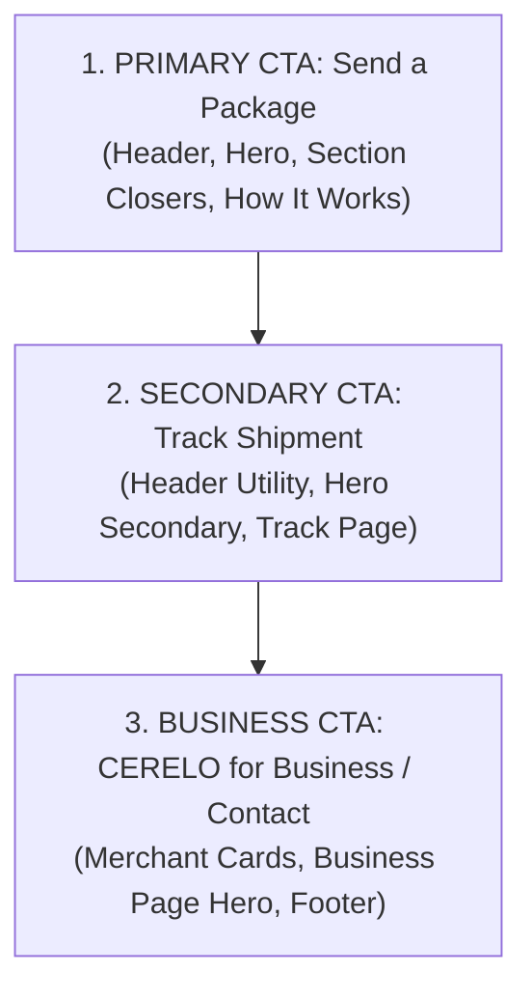

# CERELO OFFICIAL PUBLIC WEBSITE — UX & INFORMATION ARCHITECTURE
**Document Version:** 1.0.0 (V1 Release Foundation)  
**Target Domain:** `cerelonet.com`  
**Application Path:** `apps/website`

---

## 1. Executive Summary & Site Objectives

CERELO is a technology-enabled intercity door-to-door logistics platform operating on the **Kano ↔ Katsina corridor** in Northern Nigeria. The website serves as the primary digital gateway for customers, merchants, receivers, and institutional partners.

### Objective Priority Hierarchy (Locked)
1. **Immediate Comprehensibility:** A visitor must understand within 5 seconds that CERELO provides organized door-to-door intercity parcel delivery between Kano and Katsina.
2. **Operational Trust:** Visually and textually prove that CERELO replaces chaotic motor-park handoffs with verified personnel custody and an immutable ledger.
3. **Customer Conversion:** Direct individual senders and online merchants into active shipment booking via the primary conversion CTA (*"Send a Package"*).
4. **Frictionless Tracking:** Provide instant, safe parcel visibility for senders and receivers without compromising recipient privacy or security.
5. **Merchant Relevance:** Establish credibility for commercial traders (Kantin Kwari, online vendors, social commerce) who require reliable intercity logistics.
6. **Brand Credibility:** Portray a dependable, modern, Nigerian logistics company built for long-term operational scale.
7. **Institutional Trust:** Support due diligence from investors, trade partners, and regulatory bodies.

---

## 2. Target Audiences & User Journeys

| Audience | Primary Need / Core Question | Key Conversion Action | High-Priority Pages |
|:---|:---|:---|:---|
| **A. Individual Sender** | *"How do I send a parcel from Kano to Katsina without going to the motor park?"* | Tap **Send a Package** | `/`, `/how-it-works`, `/track` |
| **B. Merchant / Online Seller** | *"Can CERELO collect orders from my shop and deliver to my buyers in Katsina?"* | Tap **CERELO for Business** / **Send a Package** | `/business`, `/how-it-works`, `/faq` |
| **C. Existing Customer** | *"Where is my parcel right now?"* | Enter Delivery Code on **Track Shipment** | `/track` |
| **D. Receiver / Shared-Link Visitor** | *"What is happening with the parcel being delivered to me?"* | View masked stage-by-stage status | `/track` |
| **E. Partner / Investor / Institution** | *"What is CERELO's operational model and corridor discipline?"* | Evaluate credibility, contact team | `/about`, `/contact`, `/business` |

---

## 3. Sitemap & Page Responsibilities

```
cerelonet.com
├── /                     # Home — Value proposition, corridor spotlight, door-to-door flow, trust pillars
├── /how-it-works         # How It Works — Deep-dive 6-stage lifecycle, payment modes, cancellation rules
├── /business             # For Businesses — Kantin Kwari & SME merchant solutions, doorstep pickup
├── /track                # Track Shipment — Secure status-based tracking (CRL-XXXX-XXXX)
├── /about                # About CERELO — Northern Nigerian logistics context, operational principles
├── /faq                  # FAQ — Categorized operational answers (coverage, payments, cancellation)
├── /contact              # Contact — Customer support hotline, email, operating hub details
├── /privacy              # Privacy Policy — Customer PII protection, masked tracking policy
├── /terms                # Terms of Service — Operational scope, prohibited items, cancellation rules
├── /sitemap.xml          # Dynamic XML Sitemap
└── /robots.txt           # Crawl directives
```

---

## 4. Conversion Hierarchy & CTA Governance

To avoid competing user actions, the website enforces a strict 3-tier conversion hierarchy:



### CTA Destination Abstraction (`SITE_CONFIG.ctaDestinations`)
All CTA destinations are governed centrally in `@/lib/config/site.ts`:
- `sendPackage`: Points to application download or onboarding landing page (`/how-it-works#get-started`).
- `trackShipment`: Directs to `/track`.
- `businessInquiry`: Directs to `/business#inquire`.
- `operationsLogin`: External link to `https://admin.cerelonet.com`.

---

## 5. Homepage Narrative Structure (11 Sections)

```
┌────────────────────────────────────────────────────────────────────────┐
│ SECTION 1: HERO                                                        │
│ - Value prop: Door-to-door intercity delivery without motor-park stress│
│ - Corridor badge: Kano ↔ Katsina Dedicated Corridor                   │
│ - Primary CTA (Send a Package) + Secondary CTA (Track Shipment)        │
│ - Micro-trust tags: Verified Personnel · Chain of Custody · Cash/Bank  │
├────────────────────────────────────────────────────────────────────────┤
│ SECTION 2: THE MOTOR-PARK PROBLEM → CERELO SOLUTION                    │
│ - Clear comparison: Chaotic drivers vs. Coordinated CERELO custody    │
├────────────────────────────────────────────────────────────────────────┤
│ SECTION 3: HOW IT WORKS (4-STAGE PREVIEW)                              │
│ - 1. Request → 2. Pickup → 3. Corridor Transit → 4. Doorstep Delivery  │
├────────────────────────────────────────────────────────────────────────┤
│ SECTION 4: AUTHENTIC SHIPMENT VISIBILITY (STATUS-BASED)                │
│ - Explains verified stage handoffs (No simulated GPS maps)             │
├────────────────────────────────────────────────────────────────────────┤
│ SECTION 5: FOR INDIVIDUALS & BUSINESSES (DUAL PATHWAY)                 │
│ - Individual personal parcels vs. Merchant store-to-door deliveries    │
├────────────────────────────────────────────────────────────────────────┤
│ SECTION 6: KANO ↔ KATSINA CORRIDOR SPOTLIGHT                           │
│ - Intentional corridor focus, bidirectional daily operations           │
├────────────────────────────────────────────────────────────────────────┤
│ SECTION 7: TRUST & CUSTODY LEDGER                                      │
│ - Immutable audit log, verified personnel, controlled handoffs         │
├────────────────────────────────────────────────────────────────────────┤
│ SECTION 8: MERCHANT & TRADER CONVERSION BLOCK                          │
│ - Dedicated spotlight for Kantin Kwari merchants and online sellers    │
├────────────────────────────────────────────────────────────────────────┤
│ SECTION 9: FREQUENTLY ASKED QUESTIONS PREVIEW                          │
│ - 4–5 core questions with link to /faq                                 │
├────────────────────────────────────────────────────────────────────────┤
│ SECTION 10: CLOSING CONVERSION ACTION                                  │
│ - High-contrast Send a Package action block                            │
├────────────────────────────────────────────────────────────────────────┤
│ SECTION 11: FOOTER                                                     │
│ - Corridor notice, multi-column navigation, legal links, contact info │
└────────────────────────────────────────────────────────────────────────┘
```

---

## 6. Trust Architecture & Claim Guardrails

Logistics in Northern Nigeria requires rigorous authenticity. The website strictly abides by factual claims:

### What We PROUDLY State:
- ✅ **Door-to-door delivery:** From sender doorstep to receiver doorstep.
- ✅ **Corridor focus:** Kano ↔ Katsina (both directions supported daily).
- ✅ **Verified Personnel:** Internal authorized personnel handle physical custody.
- ✅ **Status-based tracking:** Accurate operational status progression.
- ✅ **Payment options:** Sender Pays, Receiver Pays, or Split Payment (physical cash and direct bank transfer).
- ✅ **Cancellation rights:** Full self-service cancellation before transit.

### What We STRICTLY FORBID Claiming (Locked Exclusions):
- ❌ **NO nationwide coverage claims** (V1 is Kano ↔ Katsina only).
- ❌ **NO live GPS moving maps or satellite tracking claims** (Tracking is status-based).
- ❌ **NO digital wallet, escrow, or crypto checkout claims** (Payments are physical cash / bank transfer recorded at handoff).
- ❌ **NO AI chatbot or automated route-optimization hype**.
- ❌ **NO smart box, IoT seals, or drone delivery claims**.
- ❌ **NO fabricated testimonials, fake star ratings, or unverified delivery counts**.
- ❌ **NO fleet ownership claims** (Middle-mile transit utilizes trusted commercial partner capacity).

---

## 7. Tracking Security & Privacy Architecture (`/track`)

The public tracking interface enforces the following security model:
1. **Public Identifier:** Looks up by canonical Delivery Code (`CRL-XXXX-XXXX`) or share token.
2. **PII Masking:** Full street addresses are never returned publicly. Only origin city and destination city are exposed.
3. **Contact Protection:** Sender and receiver phone numbers are fully masked or omitted.
4. **No Authentication Bypass:** A Delivery Code is a tracking identifier, **not** an authentication key.
5. **State-Safe Renderers:** Supports 5 clean states: `Initial/Empty`, `Loading`, `Verified Status Progress`, `Not Found`, and `Restricted/Cancelled`.

---

## 8. Navigation & Responsive Layout Architecture

### Desktop Header
- **Logo:** Official CERELO mark with "Intercity Logistics" badge.
- **Primary Nav:** `How It Works`, `For Businesses`, `Track Shipment`, `About`.
- **Action CTAs:** `Track` (outline) and `Send a Package` (energetic orange).

### Mobile Navigation (First-Class from 360px)
- **Top Bar:** Slim corridor reminder + Logo + Track button + Hamburger trigger.
- **Drawer Menu:** Full navigable list (`Home`, `How It Works`, `For Businesses`, `Track Shipment`, `About`, `FAQ`, `Contact`) + Full-width `Send a Package` CTA.
- **Interactions:** Accessible ARIA attributes (`aria-expanded`, `aria-controls`), body scroll lock when open, click-outside and escape-key dismissal.

### Breadcrumb Rules
- **Included on:** `/privacy`, `/terms`, `/faq` for hierarchical clarity.
- **Omitted on:** `/`, `/how-it-works`, `/business`, `/about`, `/track` to prevent visual clutter.

---

## 9. Accessibility & SEO Architecture

1. **Accessibility Standards:**
   - Skip to main content link (`#main-content`) for screen readers.
   - Semantic HTML5 landmarks (`<header>`, `<nav>`, `<main>`, `<section>`, `<footer>`).
   - Accessible heading levels (`<h1>` -> `<h2>` -> `<h3>`) without skipped ranks.
   - Visible keyboard `:focus-visible` rings using brand orange and navy.
2. **SEO Strategy:**
   - Non-overlapping search intent per route.
   - OpenGraph and Twitter cards configured with localized metadata (`en_NG`).
   - Structured dynamic XML sitemap (`/sitemap.xml`) and crawler control (`/robots.txt`).
